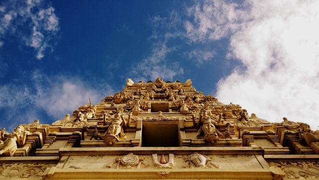
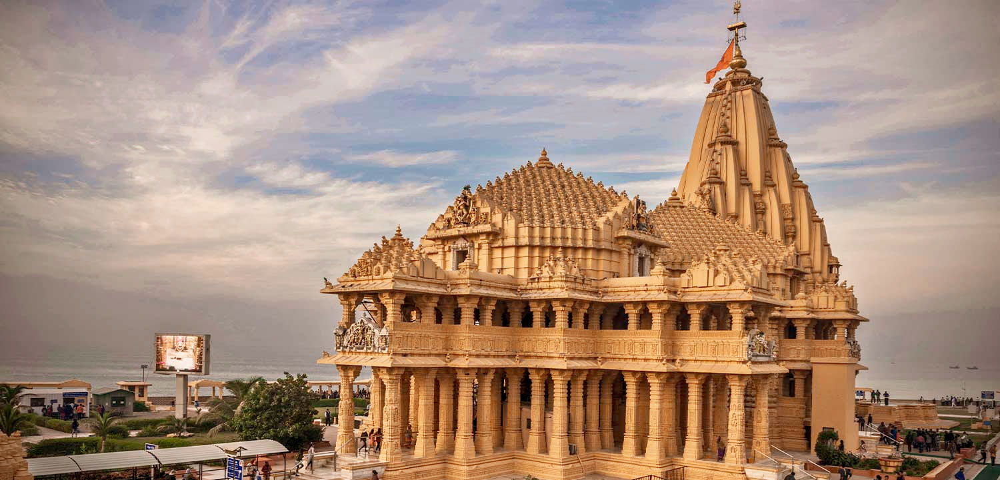
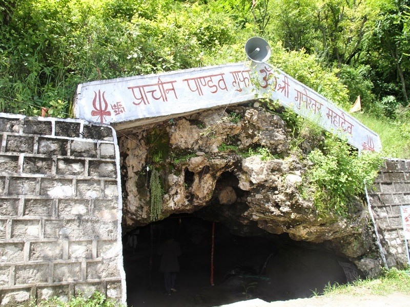
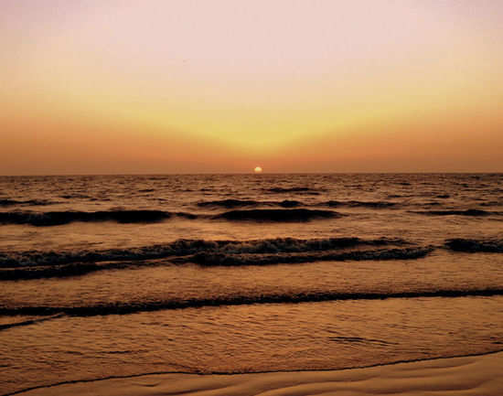
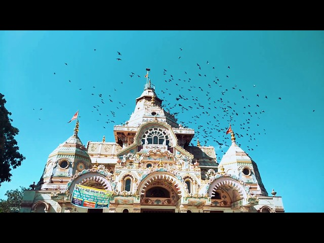

### Overview
One of the 12 jyotirlinga shrines of Shiva, Somnath Temple is also the specimen of fine architecture. Dubbed as Eternal Shrine, it is believed to be the place where Lord Krishna ended his Lila and thereafter for heavenly abode. This legendary temple is said to have vandalized numerous times in the history but with the help of zealot Hindu Kings the temple was rebuilt each time.

------
### Top Places To Visit In Somnath

###### 1. Somnath Temple – A Glorious Site 
 
Shree Somnath is first among the twelve Aadi Jyotirlings of India. It has a strategic location on the western coast of India.

Ancient Indian traditions maintain a close relationship of Somnath with release of Chandra (Moon God) from the curse of his father-in-law Daksha Prajapati. Moon was married to Twenty-Seven daughters of Daksha. However, he favoured Rohini and neglected other queens. The aggrieved Daksha cursed Moon and the Moon lost power of light. With the advice of Prajapita Brahma, Moon arrived at the Prabhas Teerth and worshipped Bhagvan Shiva. Pleased with the great penance and devotion of Moon, Bhagvan Shiva blessed him and relieved him from the curse of darkness. Pauranic traditions maintain that Moon had built a golden temple, followed by a silver temple by Ravana, Bhagvan Shree Krishna is believed to have built Somnath temple with Sandalwood.

###### 2. Panch Pandav Gufa – A Cave Temple

At a distance of 1.5 km from Somnath Temple and 2 km from Somnath Railway Station, Panch Pandav Gufa is a pilgrimage place located in Somnath. Situated near Triveni Sangam Ghat, it is one of holy and interesting places to visit in Somnath.

Also known as Hinglaj Mata Mandir, Panch Pandava Gufa in Somnath was discovered by the late Baba Narayandas in the year 1949. According to Mythological tales, it is believed that Pandavas worshipped Maa Hingalaj here, during their exile. The cave has a temple dedicated to Pandava brothers. There are also shrines in honour of Shiva, Sita Ma, Ram-Laxman, Lord Hanuman and Goddess Durga.

The entrance to the cave is very narrow and low.

###### 3. Somnath Beach – Relax Under The Sunset

Somnath Beach is located 6 km east of the port town of Veraval and just about 750 metres from the Somnath temple. The beach looks serene and one can spend hours watching the waves rumbling to the shoreline and breaking the silence that fills the air.

While swimming on the beach is not recommended, one can enjoy came and horse rides at the beach. There are also streetside eateries by the shore, where you can enjoy light snacks like tender coconut and corn. Tourists can shop for souvenirs like seashell crafts at the shops lining the shore. The beach is usually crowded by locals and tourists alike.

###### 4. Gir National Park – See The Wild Beasts 

The sanctuary’s 37 other mammal species, most of which have also increased in numbers, include dainty chital (spotted deer), sambar (large deer), nilgais (blue bull / large antelopes), chousinghas (four-horned antelopes), chinkaras (gazelles), crocodiles and rarely seen leopards. The park is a great destination for birders too, with more than 300 bird species, most of the residents. While the wildlife has been lucky, more than half the sanctuary’s human community of distinctively dressed maldhari (herders) have been resettled elsewhere, ostensibly because their cattle and buffalo were competing for food resources with the antelopes, deer, and gazelles, while also being preyed upon by the lions and leopards. About 1000 people still live in the park, however, and their livestock accounts for about a quarter of the lions’ diet.

###### 5.Kamnath Mahadev Temple – With Unique Architecture

At a distance of 2 km from Somnath Railway Station, Kamnath Mahadev Temple is an ancient Hindu temple situated close to Triveni Sangam Ghat in Somnath town of Gujarat. Situated opposite to Panch Pandav Gufa, it is one of the significant temples in Somnath and among the must include places in Somnath Packages.

Kamnath Mahadev Temple is a massive temple complex constructed 200 years ago by King Mayurdhwaj. A huge temple of the main deity, Kamnath, occupies the center surrounded by many small structures. There are two huge water bodies inside the periphery, a holy pond known as Dudhiyu Talav and a bathing pool called as 'Mahadev no Kund'. It is widely believed that King Mayurdhwaj recovered from leprosy after bathing in Dudhiyu Talav and hence many devotees come to take a dip in this pond.

Dedicated to Lord Mahadev, this temple is also the seat of Shri Sharada Peetam of Sri Adi Shankara. Within the temple complex one can also see the temple of Maa Sharada and a long, narrow cave called Shankara Cave where Adi Shankaracharya meditated for years. A spectacular presentation of all the twelve jyotirlingas of Shiva is shown at the opening of this cave.

