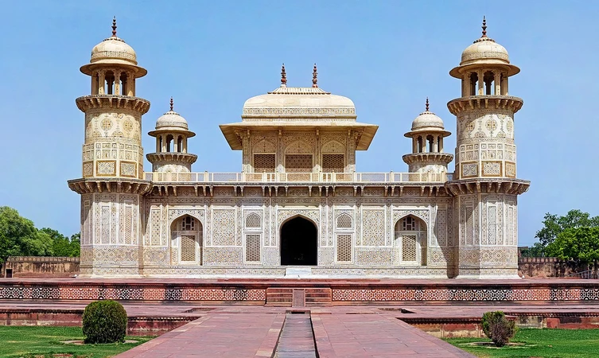
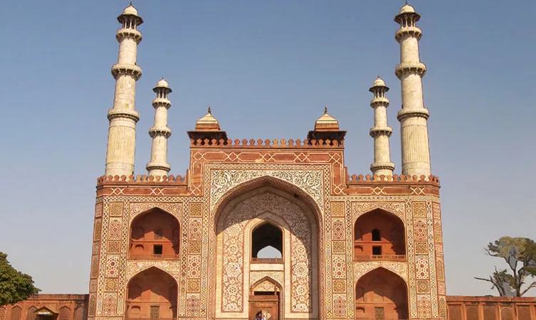
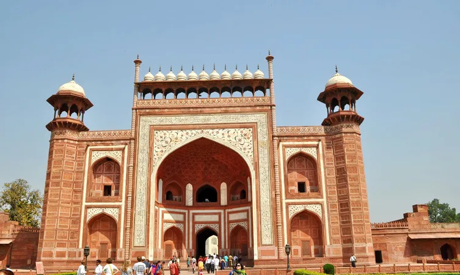
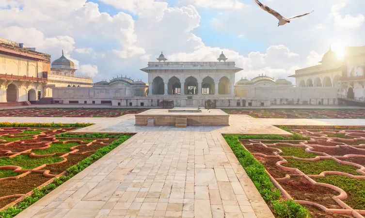
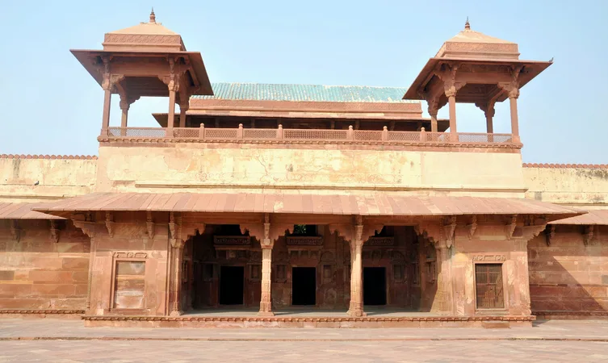
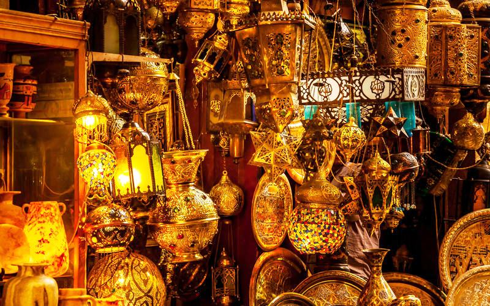

### Overview
 
 
 Home to one of the world’s seven wonders, the Taj Mahal,
 Agra is a city full of magnificent Mughal architecture. Although, there are so many more places to visit in
  Agra beyond Taj Mahal. Be it a family vacation, honeymoon, a solo trip or a group vacation with friends.
Agra has something for every trip- romantic strolling at Mehtab Bagh with your partner glaring at Taj Mahal in its full 
glory or hopping from one fort to another at Fatehpur Sikri and learning all about the Mughal architecture.
With the diverse tourist places in Agra, the city never ceases to be interesting. And the diverse tourist places like 
Wildlife SOS and Taj Nature Walk make this city all the more unique. Read on to know about these and a lot many places 
that you can visit in the magnificent city of Agra.

------
### Top Places To Visit In Agra

###### **1. Taj Mahal**
One of the seven wonders of the world, the Taj Mahal stands tall at the south bank of the river Yamuna in Agra. 
Taj Mahal or the “icon of love” is one of the best places to visit in Agra and the most popular tourist destinations in India.
It is also considered to be an epitome of the Mughal Architecture. The ivory-white marble mausoleum was built by Shah Jahan for his favorite wife Mumtaz. The monument is now where the tombs of the king and queen lie.
Taj Mahal has also been designated as a UNESCO World Heritage Site for being a masterpiece recognized all across the world. Take a walk inside the Taj Mahal and you will feel as if you’re walking through history. The ornate architecture and alluring designs will transport you to the kingly times and leave you dazed.

Location:
- Dharmapuri, Forest Colony, Tajganj, Agra, Uttar Pradesh 282001.

Timing:
- 6:00 am to 6:30 pm every day except Fridays.

Entry Fee:
- Rs 50 per person for Indians,
- Rs 1300 per person for Foreigners.

###### **2. Agra Fort**

Agra Fort was one of the most important forts during the Mughal period and is one of the finest places to see in Agra today. Akbar the great called this fort his home throughout his reign till 1605. Just like the Taj Mahal,

Agra Fort is also designated as a UNESCO World Heritage Site. History unfolds in front of your eyes as you walk through the many structures inside the fort, like Diwan-i-Khas, Khaas Mahal, etc.

Location:
- Agra Fort, Rakabganj, Agra, Uttar Pradesh 282003.

Timing:
 - 6 am to 6 pm every day.

Entry Fee:
- Rs 40 per person for Indians,
- Rs 550 per person for foreigners

###### **3.Fatehpur Sikri**

Fatehpur Sikri, a town in Agra district was once the capital of the Mughal empire. The town was built and established by Akbar and later abandoned in 1610. Like all the other tourist places in Agra, this was also entirely built with red sandstone.

The town has several significant parts to explore. The first thing that one comes across in this town is the enormous Buland Darwaza which is 54 meters in height which is sure to leave you awestruck. The surreal interiors of the town are a visual treat to the eyes and are sure to leave you spellbound.

Location:
- Fatehpur Sikri is a town in the district of Agra in the state of Uttar Pradesh in north India. It lies 37 km away southwest of Agra city.

Timing:
- 6:00 am to 6:00 pm every day except Fridays.

Entry Fee:
- Rs 10 per person for Indians,
- Rs 250 per person for Foreigners

###### **4.Itmad-ud-Daulah's Tomb **

Another Mughal mausoleum on the bank of the river Yamuna, Itmad-Ud-Daulah’s Tomb is one of the best places to visit in Agra. The architecture and interior are known to be inspired by that of Taj Mahal’s as it also has traces of white marble from Rajasthan amidst the red sandstone. And for the same reason, it is also known as the “Baby Taj”.

The tomb was built by Nur Jahan in 1628. The delicately designed jali screens from white marble beautifully light up the interior of the tomb. Don’t miss the semi-precious stones engraved in the white marble interiors of the tomb.

Location:
- Moti Bagh, Agra, Uttar Pradesh 282006.

Timing:
- 6 am to 6 pm.

Entry Fee:
- Rs 20 per person for Indians,
- Rs 210 per person for Foreigners

###### **5. Akbar’s Tomb **

Akbar’s Tomb was built by Jahangir in 1613. If you’re a history buff, this is one of the best places to visit in Agra for you. The tomb is built in red sandstone and holds some of the most stunning marble designs.

As you walk into the building, you’ll find exquisite marble designs on the ceilings and mystical calligraphy towards the real underground tomb of Akbar.

The biggest gate around the tomb is the south gate where you will see intricate white marble designs on the panels. The real tomb of Akbar is in a small underground room which has a very transcendent feel to it.

Location:
- Tomb of Akbar The Great Area, Sikandra, Agra, Uttar Pradesh 282007.

Timing:
- 10 am to 6 pm every day except Fridays.

Entry Fee:
- Rs 15 per person for Indians.
- Rs 110 per person for Foreigners

###### **6. Jama Masjid **
One of the biggest mosques of India, the Jama Masjid in Agra is known for its intrinsic designs and unique architecture. The mosque is situated right across Agra Fort and is one of the most well-known tourist places in Agra.

The gigantic mosque was built by Shah Jahan for his daughter Jahanara Begum. The beautiful designs on the tomb and the red sandstone construction of the mosque will leave you bewildered with the Islamic architecture.

Location:
- Jama Masjid Rd, Subash Bazar, Kinari Bazar, Hing ki Mandi, Mantola, Agra, Uttar Pradesh 282003.

Timing:
- 6 am to 6 pm every day.

###### **7.The Sikandra Fort **

The Sikandra Fort homes the great emperor Akbar’s Tomb. The fort is known for its magnificent gates, tombs, and red sandstone designs which makes it one of the most visited tourist places in Agra. The fort is also known for its architecture which is a blend of Islamic and Hindu designs.

Although the tomb is of Akbar- the greatest Mughal emperor, the architecture of this fort has a strong influence of Hindu architecture. This can be seen with the finials, balconies and window designs. As you will move around the fort, the excellent craftsmanship and intricate stone carvings will leave you astonished.

Location:
- Tomb of Akbar The Great Area, Sikandra, Agra, Uttar Pradesh 282007.

Timing:
- 6 am to 6 pm every day.

Entry Fee:
- Rs 15 per person for Indians.
- Rs 110 per person for Foreigners.

###### **8.Anguri bagh **
A landscape of verdant greenery awaits you in the sprawling gardens of Anguri Bagh that is located in Khas Mahal in Agra Fort. The place is a nice place to visit in Agra to relish some tranquil moments and take a dive into the history of Mughals who ruled Agra in the past. Known for its thick creepers, it is called the Garden of Grapes and decorated by many marvellous paintings of gold. The garden has a hall and is embellished by various tanks, fountains and hammams. 

Location: 
- Agra Fort, Rakabganj, Agra, Uttar Pradesh

Timing: 
- 6:00 AM TO 7:30 PM

Entry Fee:
- INR 40

###### **9.Jodha Bai ka Rauza **

Jodha Bai ka Rauza or Jodha’s Palace in Agra was built by Akbar for his favorite queen Jodha. The monument stands as a symbol of peaceful Hindu-Muslim relations which makes it one of the most popular tourist attractions in Agra.

It is the biggest palace in Fatehpur Sikri made of red sandstone like all the other palaces. Although, what makes it stand out is the blend of Gujrati elements in the architectural designs and the beautifully painted blue ceilings.

Location:
- Dadupura, Fatehpur Sikri, Uttar Pradesh 283110.

Timing:
- 7:30 am to 6 pm.

Entry Fee:
- Rs 35 per person for Indians,
- Rs 550 per person for Foreigners.

###### **10. Bazaar **

Located near Agra Cantonment railway station, Sadar Bazaar is the most famous spot in Agra which attracts a good number of tourist.  If you are looking for products like handicrafts, garments, some delicious sweets, leather products, then this place can be the best option for you from where you can find best possible deals.

There is a well-known store named as Taj Leather World is located in the same market offers good reasonable deals of quality products. Basically, if you want to purchase good quality products at a cheaper price comparatively, then there is no better place than Sadar Bazaar. Along with the well known Cafe Coffee Day, there are many other food spots available from where can have a tasty meal.

Location: 
- Close to Agra Cantonment railway station, Agra
Timings: 
- 11:30 AM-6 PM
