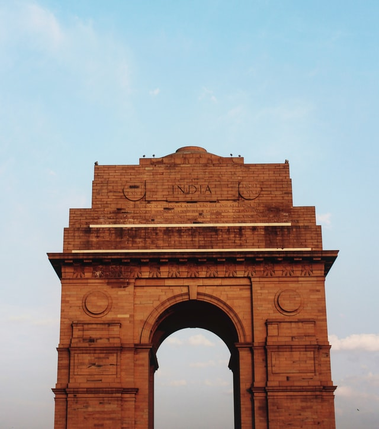

Delhi, for all the right reasons, is the national capital of incredible India. Synonymous with diversity, Delhi has always been the epicentre of all activities in India which is reflected in its tourism. Right from the time of Pandavas, it has served as a major strategic and cultural hub of the country and rightly so, today it’s an exhibition of the history of India. Travelling in Delhi isn’t just limited to history but it’s a step to take past and present hand in hand. Blended with modern advancements, Delhi is the modern-day city of Troy. The amalgamation of all religion and spiritual hubs of different faiths coexisting together in peace is the testament of the unity in diversity. Delhi offers numerous tourist attractions ranging from monuments, museums, shrines to modern day markets. Exploring the city is like witnessing a mini-India, with Delhi Tourism being a reflection of rich culture of India.

### Best time to Visit Delhi:
Delhi should be best explored during winters when it witnesses cold but moderately pleasant weather.

### Top Places To Visit In Delhi

##### 1. Akshardham Temple, Delhi
Dedicated to Bhagwan Swaminarayan, Akshardham Temple exhibits the ancient culture of India. The temple complex maintains a step-well styled courtyard and 60 acres of lush lawns featuring the bronze statues of Indian heroes, including patriots and warriors. Registered as the World’s largest comprehensive Hindu temple in the Guinness World Record, the temple is an architectural marvel built from intricately carved sandstone and marble.  Furthermore, the temple organizes exhibitions on Swaminarayan’s life teachings and also organises a musical fountain and light show after sunset every day.

1. Timings: 09:30 am to 06:30 pm
2. Entry Fee: INR 170 (Adults); INR 100 (Children)
3. Nearest Metro Station: Akshardham, New Delhi

##### 2. Red Fort, Delhi

Constructed in 1639 by the Mughals, Red Fort gets its name from its massive red-coloured sandstone walls. Set in Old Delhi, the octagonal-shaped fort is spread over an area of 254 acres. The planning and designing of the fort is a fusion of Mughal, Persian, Hindu, and Timurid traditions. A strong influence on later structures built in and around Delhi, Red Fort also features a museum that holds Mughal-era artefacts, including daggers, curtains, miniature paintings and carpets. The highlights of this architectural creativity include the peacock throne, step well, imperial bath, Moti Masjid and Hira Mahal.

1. Timings: 09:30 am to 04:30 pm (closed on Mondays)
2. Entry Fee: INR 10 (Indian citizens) and INR 150 (foreign nationals)
3. Nearest Metro Station: Chandni Chowk, New Delhi

##### 3.India Gate, Delhi

India Gate symbolises the sacrifice of 70,000 Indian soldiers who lost their lives battling against the foreign army during the World War I. Designed by Edwin Lutyens, it features the undying Amar Jawan Jyoti or the Flame of the Immortal Soldier which was added later to honour Indian martyred soldiers in the Indo-Pak War. Furthermore, this beautiful masterpiece is counted amongst the largest war memorials in India. Standing on a Bharatpur stone base, the structure is surrounded by lush lawns making it a popular picnic spot during winter afternoons and summer evenings. Lit at night, the monument looks magnificent with colourful fountains in the in the vicinity.

1. Timings: 24 hours a day, seven days a week
2. Nearest Metro Station: Central Secretariat, New Delhi

##### 4.Hauz Khas, Delhi

If you are a party animal, then definitely head to Hauz Khas, which is popular for its swanky clubs, quirky cafes, and fine-dine restaurants. Earlier known as Hauz-e-Alai, this affluent neighbourhood in South Delhi holds a historical importance with remnants of Mughal architecture. The place is popular for a 13-century structure, Hauz Khas Complex, which retains the old charm amidst the modernised street. Besides raving it up at urban village in Delhi, we suggest you take delight in the greenery of Deer Park, splurge at designer label boutiques and admire the fine artwork at various art galleries.

1. Timings: Most of the restaurants and pubs remain open till midnight
2. Nearest Metro Station: Hauz Khas, New Delhi

##### 5.Kingdom of Dreams, Gurgaon

Situated near the Leisure Valley Park in Gurugram, Kingdom of Dreams is an ultimate entertainment destination. It is designed with the intent of displaying the rich Indian culture by means of a majestic structure. Besides its splendid architecture, the place features Nautanki Mahal, an auditorium which showcases fanciful cinematic musicals and hosts a number of live entertainment shows, including Indian and international theatre. Additionally, the place houses Culture gully, where you can witness a boulevard dedicated to unique Indian culture, arts and crafts, and authentic cuisines.

1. Timings: 12:30 pm to 1Entry Fee: INR 1099 onwards (On Weekdays); INR 1,199 (On Weekends)
2. 2:00 am on weekdays and 12:00 pm to 12:00 am on weekends
3. Nearest Metro Station: IFFCO Chowk, Gurugram

