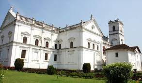

### Overview

Goa, though carrying a rich colonial past, has attained fame as India’s centre of international tourism. Its present culture still reflects the association to its multi-cultural roots in the form of many churches, temples and synagogues that are located here. However, with the younger crowd, it is renowned as the destination to go to for a fun-filled and partying getaway.

For tourists who prefer natural experiences Dudhsagar Falls, Bondla Wildlife Sanctuary and Dr. Salim Ali Bird Sanctuary are good options to explore. Goa’s many beaches are places where one can indulge in watersports or simply lounge around in the shacks located there. Basilica of Bom Jesus, Shantadurga temple and Church of St. Francis of Assissi are few of the religious places one can visit while touring Goa. 

Water sports and nightlife can be experienced at the beaches. Go on a river cruise, visit the churches and temples, enjoy wildlife and bird watching, and appreciate scenic beauty.

------
### Top Places To Visit In Goa

###### ** 1. North goa **

Goa – the party capital of India comprises of two major districts namely North and South Goa. The districts are bounded by various other districts with Sindhudurg of Maharashtra lying in the North and Belgaum of Karnataka lying to the east. The Arabian Sea surrounding the North Goa district from the west and quite naturally, the South Goa district bounding the former from the South.

North Goa has a greatly revered history lying behind it. Most of the territories situated in North Goa were once under the kingdom of Sawantwadi. Sawantwadi was majorly dominated by Pondawas and Marathas. Hence, quite naturally, this region was primarily dominated by Hindus who later on became to be living under the Portuguese Inquisition – who pretty much changed the face of the whole of Goa itself. Post the 18th century, the Portuguese became prominently the dominators of the region of Goa and much change was brought it.

While Konkani is the mother tongue of the majority of the people residing in the North Goa district, there is a special blend of the Portuguese and Indian culture that you will get to witness in this region. The place consists of tonnes of beaches being kissed by beautiful, salt-ful oceans and one of the best times to visit Goa is during monsoons as it is another joy to watch the small but quite region come to life.

Apart from that, there are a number of activities that one can choose from especially the varied watersports available for the use of tourists. The night-life is quite obviously commendable too.

###### ** 2. South goa **

For a beach holidays, places in South Goa offer the best of scenic tours and beautiful resorts to stay. Goa is one of the most popular international tourist places in India. You will find tourists from all over the world visiting this place for partying, water sports, nightlife, delish sea food, and hiking on beaches. There is more to Goa than Baga Beach and its adventures. When you travel south, you will be mesmerized to find beaches with serene and crystal clear water and beauteous surroundings. There are beaches, clubs, shopping sprees, eatery joints, temples, cathedrals, and more places to see when you start exploring south Goa.

There is roaster of things to do when you visit Goa, apart from enjoying time on the beaches. Every spot in Goa beams with happiness. South Goa has offbeat activities and heritage tours that you might not find in other parts of Goa. South Goa is your sweet and serene escapade for offbeat and adventurous activities. You can go on cruises, visit wildlife sanctuaries, take enjoy cruise parties, and shop at the market places for throw away prices. South Goa offers you best of food, recreation, sightseeing, and other amusement options for people of all age groups. Most of the residential buildings are colorful, and white is the only color not used on these buildings.

###### ** 3. Old Goa **

Old Goa, also fondly referred to as Velha Goa comprises of a deeply historic portion of Goa. The city located in the Northern region of the state was originally constructed by the Bijapur Sultanate that can be dated back to the 15th century. In fact, this place was so popular that it served as the capital of the Portuguese India from the time they ruled in the 16th century till the end of the 18th century. Unfortunately, plague struck back then and much of it was remained to be in ruins. However, whatever does exist holds great value and is also considered to be a UNESCO World Heritage Site.

The formation of the name, Old Goa can be traced back to the 1960’s. One could find simplistic rural life in this place. Much can be accredited to the Portuguese as it is only after their arrival and consequent departure that this city gained tremendous popularity.

The beauty and richness of this ancient city reflects so much power that a Dutch visitor once compared it with Amsterdam. Old Goa of today is located approximately 9 kilometers east of Panaji. This city is filled with churches, convents, monuments, forts and a kind of very relaxing scenario.

There are a range of activities that Old Goa offers to its visitors. The night-life is quite soothing and relaxing as well. Old Goa – on the contrary to the wide belief of Goa being the party hub of India – is the perfect getaway for those looking for a solace and calming time out of their busy, bustling city – life schedule.

###### ** 4. Candolim **

Candolim promises to be a fun-filled sojourn on your visit to Goa. Located in Bardez Taluka of North Goa, which is a popular tourist attraction, Candolim is a one-stop shop for visitors due to the large number of clubs and parties held here. Besides the happening streets, Candolim also houses the largest beach in Goa, making it one of the most happening spots in Goa.  

The Candolim beach, which is a 5 km white sand jewel, offers numerous water adventure sports to adrenaline enthusiasts. Bask in the Sun or walk by the sea as the pristine waters at Candolim touch your feet. Candolim also offers visitors a chance to relish the exotic Goan cuisine by the beachside as the region is dotted with several multi cuisine food joints and shacks, offering you an opportunity to sip a drink while staring at the horizon.

Located near the popular beaches like Baga and Calangute, Candolim offers an ideal blend of privacy and frenzy in the beach city. The region is also dotted with several luxurious hotels and guesthouses, allowing you to choose your ideal accommodation. Immerse yourself in the views of the setting Sun and prepare yourself for a happening evening as Candolim promises to make your trip to Goa memorable. 

###### ** 5. Bambolim Beach **

If you are searching for a scenic beachside retreat, then Bambolim Beach will be the ideal destination for your vacation. Situated in North Goa, the beach lies nestled amidst tranquil settings and will surely serve as the perfect getaway from the city’s din. 

Flanked by coconut trees, the picturesque place is not known by many tourists and thus cherishes its intrinsic aura of serenity. 

Only 7 km away from Panaji, this beach greets you with its golden sand beaches, the cerulean waters of the calm Arabian sea and its pristine beauty.
A visit to this place with family and friends can offer you some memorable moments of a perfect weekend.

You can relax and enjoy a family picnic on the beach, engage in some fun-games with your friends, bask in the sun or plunge in for a refreshing swim in the cool waters. 

The nearby guest houses will also render you a comfortable sojourn for the night and offer you an exquisite range of the sumptuous Goan dishes. Dotted with inviting shacks, the beach often lures young people who visit this peaceful place to unwind and soak themselves up in sheer bliss. 

So if you happen to be in Goa, then do embark upon a scenic drive to Bambolim Beach to embrace nature in its spectacular beauty

###### ** 6. Salim Ali Bird Sanctuary **
 Salim Ali Bird Sanctuary  is a piece of ornithological heaven on the bank of River Mandovi which is home to more than 473 species of birds and rare animals in the midst of thick mangrove vegetation. The place gets its name after the renowned ornithologist Dr. Salim Moizuddin Ali and fairly boasts of its uniquely rare eco system where you can gain an insight into the habits and habitats of wild animals and birds. Located on the Chorao Island on the southern tip of Goa the sanctuary abounds an estuarine mangrove ecosystem providing a suitable environment for the breeding of some rare species of animals and birds. 

The Salim Ali Bird Sanctuary got its first recognition as a national park in 1988 by the Forest Department of Goa and hence forth attracting birders from different parts of the world. However, the sanctuary is home to numerous other wild animals that have made the place their natural habitat. The crisscross water channels running through the mangrove vegetation of the park are inhabited by mudskipper fish and marsh crocodiles that can be spotted during low tides. 

The park offers boat trips in dugout canoes across its mangrove swamps giving you a pleasurable outing experience along with fair knowhow about the aquatic fauna of the park. From the watchtower inside the park, you can enjoy an aerial view of the surroundings and watch the intriguing behaviour of the birds and animals. 

Apart from wildlife expedition, Salim Ali Bird Sanctuary is also a great retreat for outdoor activities such as boat riding, nature hiking, sightseeing, outdoor picnic and bicycle tours. Below we have provided some additional facts about this sylvan retreat in Goa

###### **7. Aguada Fort **

Aguada is a Portuguese word which means “Water" so basically this Fort was renowned as the biggest water reservoir in Asia. As you will visit the campus of  Aguada Fort you can easily remember the scenes by several Bollywood movies which were shot here. You will be amused by the beauty of this place.You can witness the endless sea, a beautiful lighthouse and an amazing fort which altogether will give you feel of a perfect landscape. 

This fort was built by the Portuguese rulers and has beautiful Italian design carved on the walls. You can see a  massive reservoir and a huge bell there. The Fort has a glorious history and is seen as an important part of Nation as it stands holding the pride and conveying its significance to the generations. You can also see the gunpowder room in the upper fort and it is said that earlier there were 200 cannons installed for the defence of locals. 

Its brilliant architecture as well as the breath-taking views it offers of the Arabian Sea collectively make it a top tourist fascination in the region. 
It is also a great spot to watch sunsets while in the Party Capital of India

