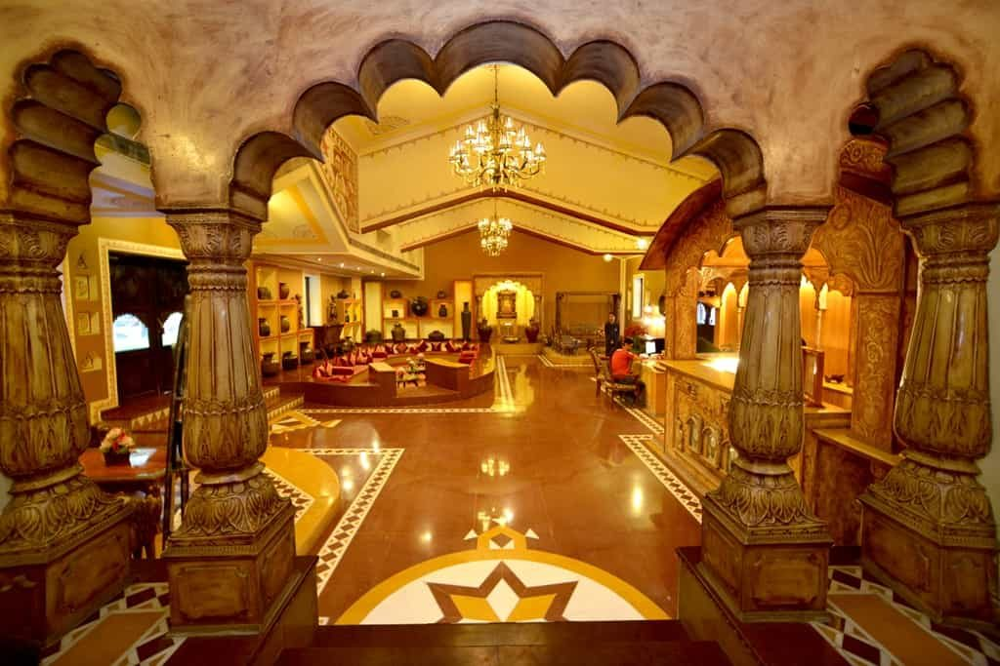

### Overview
The capital of Rajasthan and the land of the royals themselves, Jaipur is an elegant city painted in pink and a photographers delight! A royal and historical capital, Jaipur is the gateway to one of India’s most flamboyant states. There are several attractions in Jaipur that ooze out the majestic past of the city. For these splendours of heritage marvels, a plethora of tourists from all over the world come here and enjoy the royal experience of the Rajputana graciousness. 

At the city’s heart, several palaces, gardens and bustling markets have draped themselves in the warm hue of pink as the colour symbolizes hospitality. On the way from this benevolent expanse to the outskirts, there are various places to see in Jaipur like the hilltop forts and well-preserved museums that will tell you the impressive chronicles of the Rajput kings and queens. 

What’s not to be missed is the exquisite and contemporary boutiques, hotels and restaurants that will make you feel like modern royalty. With all these and a lot more extravagant tourist places in Jaipur, you will surely get to have remarkable encounters amidst Rajasthani regality.
### Top Places To Visit In Jaipur

###### **1. Amber Fort and Palace **

Located amidst the picturesque and rocky Aravalli Hills, Amber Palace is a not-to-be-missed place to in Jaipur. The foundation stone of this palace was laid by Raja Man Singh I and was completed by Mirja Raja Jai Singh. The beguiling beauty of the red sandstone and white marble adds to the magnificence.

While the high formidable walls defended its residents from enemy attacks, the main building of the citadel served its people with all the luxuries and amenities .The scenic backdrop of the Maota Lake and panoramic views of sunrise and sunset contribute to the eternal beauty of this palace. Intricate wall paintings, frescos and the use of precious gems and jewels in these paintings add to its timeless beauty.

Sheesh Mahal or the ‘Palace of Mirror’ is also one of the captivating halls to visit within Amber Palace. Decorated with numerous pieces of mirror tiles, this hall was designed in such a way, even a single ray entering into it can illuminate the entire hall.

Location:
- Devisinghpura, Amer, Jaipur, Rajasthan 302001

Timing:
- 8:00 a.m. to 5:30 p.m.

Price:    
  - For Indians: 25Rs. (Inclusive of Entry & Camera )
   - Foreign Nationals: 150 Rs. (Inclusive of Entry & Camera)

###### **2 Nahargarh Fort **
To get a panoramic view of Jaipur city, Nahargarh Fort is the ideal place to visit. Built by Jai Singh II, Nahargarh Fort was originally named Sudarshangarh and was later renamed as Nahargarh or the Abode of Tigers. The then Maharaja of Jaipur constructed this fort in order to tighten the security of the region. It also served as a safety shelter to the British wives during the Sepoy Mutiny of 1857.

Located on the rocky ridge of Aravalli Hills, Nahargarh Fort offers the most striking view of Jaipur’s scenic landscape. During the night, when the entire Jaipur city gets lit up, Nahargarh Fort offers the most sparkling view of the entire city.

Rooms in this fort are connected through common corridors and are well decorated with delicate wall and ceiling paintings. The royal families also used this fort as a popular destination for their summer excursions and as one of their picnic spots in Jaipur. Jungles around Nahargarh Fort served as popular hunting places for the Maharajas of Jaipur.

Location:
- Krishna Nagar, Brahampuri, Jaipur, Rajasthan 302002

Timing
- 9:30 a.m. to 5:30 p.m.

Price:
  - For Indians: 10Rs (Adults)
  - For Foreign Nationals: 50 Rs (Adults)

###### ** 3 Hawa Mahal **

Hawa Mahal or Palace of the Winds, or also called Palace of the Breeze, is one of the important places to visit in Jaipur. Built by Maharaja Sawai Pratap Singh in 1798, Hawa Mahal is a five-storey extension in the form of a honeycomb. This unique building has 953 small windows, called jharokhas, decorated with intricate latticework. The entire palace represents the crown of the Hindu God, Lord Krishna.

Even though this palace was built during ancient times, it reflects the scientific vision of Maharaja Sawai Pratap Singh in a distinct way. The windows of this palace have been designed in such a way that irrespective of the time or season of the year, cool breeze always persists inside the palace. Due to this reason, Hawa Mahal was the favourite summer holiday destination of the Rajput family and is today a popular place to visit in Jaipur.

Another purpose of this palace was to prevent outsiders from catching a glimpse of the royal women. The incredible lattice of windows were designed in a way that it allowed a clear view of the outside world to the insiders, yet restricted outsiders from being able to stare inside the palace.

Location:
- Hawa Mahal Rd, Badi Choupad, J.D.A. Market, Pink City, Jaipur, Rajasthan 302002

Timing:
- 9:00 a.m. to 4:30 p.m.

Price:
   - For Indians: 10 Rs.
   - For Foreign Nationals: 50 Rs
   - Entry is Free on Monday and Closed on Friday

   

###### **  4. Jal Mahal**
It was during the Rajput era that India has seen some of the glorious forts and palaces. Jal Mahal or the Water Palace is one of the classic names in the list of Rajputana architecture.

Located in the middle of the Man Sagar Lake, this palace is also a fusion of Mughal and Rajput styles of architecture. Built in red sandstone, Jal Mahal is a five-storey building, of which four storeys remain underwater when the lake is filled. This, in turn, offers a breathtaking view of the palace and makes it one of the important Jaipur tourist places so if you are in Jaipur, Jal Mahal is one of the must-visit places in the tour list.

Since the palace is located in the middle of the lake, traditional boats are used to reach the palace. The clear water of the lake and the scenic Aravalli mountain range dotting this palace, offer a splendid view of Jal Mahal.

The location of Jal Mahal makes it an indigenous home to some of the colourful migratory birds, several species of fish and rich flora and fauna. Flamingo, Great Crested Grebe, Pintail, Kestrel, Coot and Grey Wagtail are some of the migratory birds that can be found around Jal Mahal.

Location:
- Amer Rd, Jal Mahal, Amer, Jaipur, Rajasthan 302002

Timing:
- 6:00 a.m. - 6:00 p.m.

Price:
- Free

###### ** 5 Jantar Mantar **

Maharaja Sawai Jai Singh, the ruler of Jaipur was one of the best theorists of ancient India. After achieving the milestones of constructing the planned city Jaipur, as well as several other scientific and architectural epitomes, the Maharaja built five astronomical instruments to study space. These instruments were called Jantar Mantar, which means Calculating Instrument. The largest of these instruments is located in Jaipur and has been declared as a World Heritage Site by UNESCO.

Jantar Mantar consists of fourteen geometric devices that measure time, predict eclipses, track the location of stars and the Earth’s movement around the sun. Samrat Yantra is the largest instrument in this observatory and it was used to forecast time. Plotting the shadow of Samrat Yantra, the time for eclipses and the arrival of monsoons can be calculated. Samrat Yantra is also the largest sundial in the world.

Jantar Mantar now serves as one of the major Jaipur tourist places and a pioneering source to amateur astronomy students.

Location:
- Gangori Bazaar, J.D.A. Market, Pink City, Jaipur, Rajasthan 302002

Timing:
- 9:30 a.m. to 4:30 p.m

Price: 
 - For Indians: 50 Rs (Adults)
 - For Foreign Nationals: 200 Rs (Adults)

 
###### **6 Chokhi Dhani **

Chokhi Dhani, the only five-star rated ethnic village resort in India, is one of the best places to visit in Jaipur.  Located in the neighbourhood of Jaipur, Chokhi Dhani is the replica of a traditional Rajasthani village. Chokhi Dhani opened its cultural door to tourists in 1989 and since then, it has been entertaining its visitors with all the colours of Rajasthan’s ethnicities.

Restaurants in Chokhi Dhani serves traditional Rajasthani foods that can make your appetite grow larger than you can ever imagine. While the folk music and traditional dancers will make your feet tap to their rhythm, health club, swimming pool and spas in Chokhi Dhani will help you relax your mind. While in Chokhi Dhani, you can also witness the popular puppet shows of Rajasthan.

Location: 
- 12 Miles Tonk Road, Goner Mod Flyover, Sitapura, Jaipur, Rajasthan 303905

Timing:
- 5:30 pm to 11 pm

Price: 
   - Rs. 750 / person Standard package.
   - Rs. 950 / person Royal package
   - Rs. 1200 / person for multi cuisine restaurant.

###### ** 7 Albert Hall Museum **

After the foundation stone of this museum was laid in 1876 to commemorate the visit of the Prince of Wales, there arose confusion about the usage of this hall. Plenty of suggestions came in asking for using this hall for educational or political use, none of which held good!

In the year 1880, one of the local surgeons of Jaipur, Dr Thomas Holbein Hendley suggested to the then ruler of Jaipur, Maharaja Sawai Madho Singh II to open a museum within this hall. The Maharaja liked this suggestion and thus the Albert Hall Museum took shape.

In the beginning stage, Albert Hall Museum displayed the products of local artists and craftsmen.
 With passing centuries, collections in this museum have increased to a great extent and have brought this museum to international level.

This museum is also home to one of the six ‘Egyptian Mummies’ in India. This Mummy was gifted as a souvenir to the museum by the Brugsch Bey of the Museum of Cairo.

Location:
- Museum Road, Ram Niwas Garden, Kailash Puri, Adarsh Nagar, Jaipur, Rajasthan 302004

Timing:
- 9:00 a.m. to 5:00 p.m

Price: 
 - For Indians: 20 Rs (Adults)
 - For Foreign Nationals: 150 Rs (Adults)

 
###### ** 8 World Trade Park **

A high-end shopping mall in Jaipur that is renowned for its architectural design. Bollywood superstar Shahrukh Khan is one of the investors of this mall. It is amongst those places to see in Jaipur that provide a unique shopping experience to the visitors. 

The 11-story building is less like a mall but more like a monument. Here you can shop till you drop from over 500 stores of the pompous luxury brand. Both western and ethnic clothing collections are available at the mall. Further, you will find a wide variety of cafes and restaurant as well as a Cinepolis multiplex. Thus, it is a one-stop location for shopping, food, and entertainment.

Location:
- Jawahar Lal Nehru Marg, D-Block, Malviya Nagar, Jaipur, Rajasthan

Price:
- Entry free

Timing:
- 11 am - 10 pm

