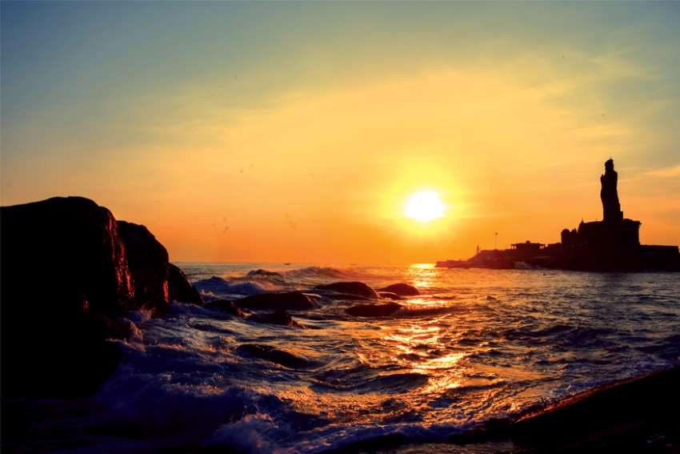
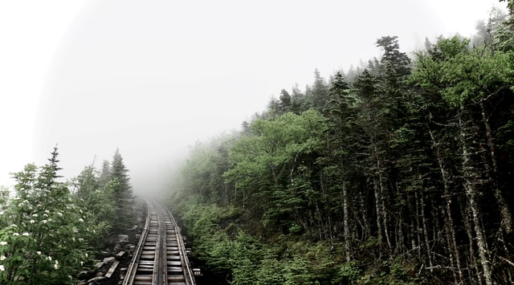
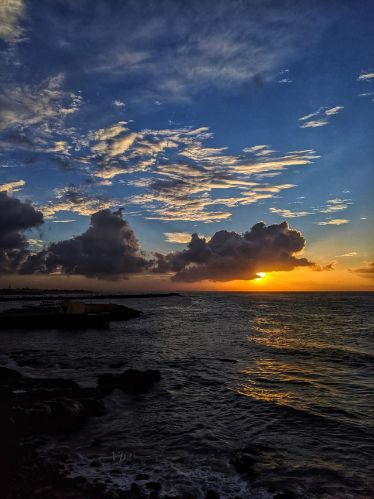
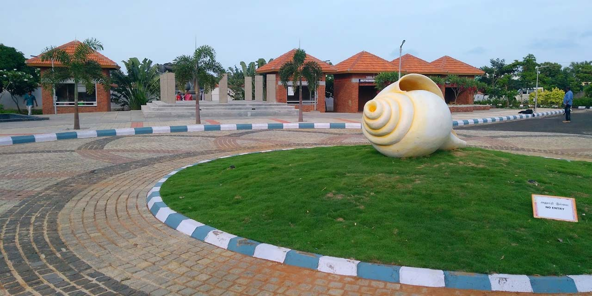
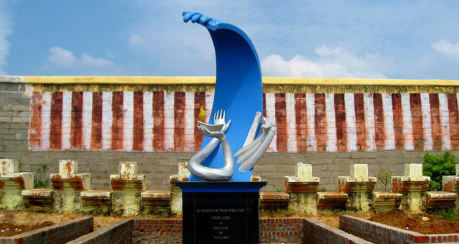
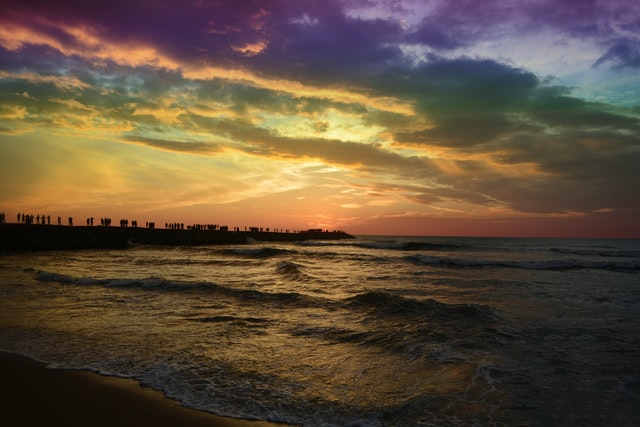
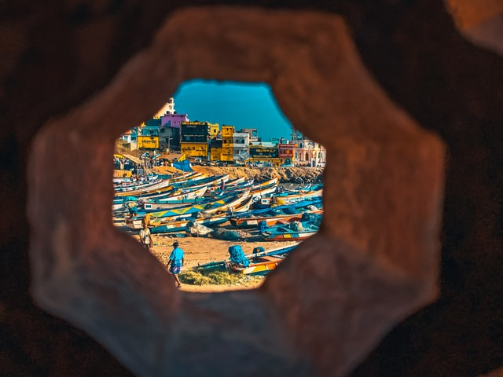
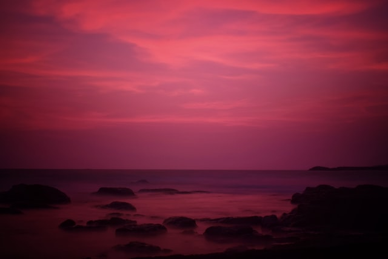

Kanyakumari is one of the smallest, yet most beautiful coastal towns on the southern tip of India. Kanyakumari was called Cape Comorin by the British, probably as the area is a Cape and the anglicized version was far easier to pronounce.

Kanyakumari, which had been ruled by the Kings of Travancore in Kerala, was later merged with Tamil Nadu as per the Indian States Reorganization Act of 1956. Kanyakumari District has four Taluks, viz- Agasteeswaram, Thovalai, Kalkulam and Vilavankode. Every taluk has its own tourist treasures that would be worthy of a trip.

Mahendragiri and Agasthiyarkudam peaks of the Western Ghats and the Agasthiarmalai and Maruthuvamalai hills add to the charm of the region, along with lush streams, waterfalls, dense virgin forests and the beaches that make Kanyakumari one of the hottest tourism zones of South India, not the mention the spectacle of the Bay of Bengal and the Arabian Sea converging with the Indian Ocean, topped by an amazing vision of the sun setting beyond the waters! There are ancient temples and monuments too, that are bound to keep pilgrims and history buffs happy. If you would like to visit Kanyakumari, our travel guide will help you plan a memorable trip. 

------

### How to reach?

The best way to reach Kanyakumari would be by train.

 
#### By Air:
Trivandrum Domestic and International Airports are closest to Kanyakumari. Take a flight to Trivandrum and a bus or a cab to Kanyakumari. You could also take a train from Trivandrum Pettah Railway Station to Kanyakumari.
 
#### By Train:
Kanyakumari has trains from most major Indian cities including long distance trains from the northern tip of India. Travelling by train to Kanyakumari through beautiful landscapes is an experience by itself!
 
#### By Road:
There are buses to Kanyakumari from major cities. A bike trip from Kashmir to Kanyakumari is an exhilarating experience for solo riders! You could also drive to Kanyakumari.
 
#### Getting Around:
There are local buses and auto rickshaws for getting around in town. You could hire cabs for long distance trips.

------

### Weather and the Best Time to Visit

Kanyakumari has a warm, humid climate through the year. It’s an all season destination, but the best times are from December to February.

 
#### Summer (March-May):
Summers are hot, but not as scorching hot , thanks to the seas. Evenings are cool and you can plan exotic getaways for sunset. Mango showers are a common phenomenon.
 
#### Monsoon (June-November):
Southwest monsoons are heavy. You can expect heavy rains from July to September, with floods in low lying areas. Monsoon is not a good time for sightseeing.
 
#### Winter (December-February):
This is the ideal season for visiting Kanyakumari. The days are warm and pleasant, while nights could be cold. You can spend long hours at the beaches, go shopping or trekking to the hills in winter. Monsoon rains turn waterfalls into luxuriant cascades.

------

### Things to Do

#### Udaigiri Fort:
De Lannoy’s Fort, built of massive granite blocks was a camping ground for the Travancore rulers. It was used as a jail for Tipu Sultan’s soldiers in the 18th century AD. Surrounded by massive hills and lush undergrowth, the Fort is now a Biodiversity park. Check out the tomb of De Lannoy, the Dutch captain of the Travancore Army. The Fort is 30 km from Kanyakumari.
 
#### Muppandal:
Envision a vast expanse of fields dotted with giant windmills, like in the story of Don Quixote! That’s Muppandal, for you. Muppandal that produces 1500 MW of renewable wind energy is said to be the biggest in India and one of the major wind farms of the world. Muppandal is 25 km from Kanyakumari.
 
 

#### Eco Park:
This is a complete family getaway. While the kids are at the Kids Play Zone, take a break, strolling around the park, which has ancient trees, a rock mountain and plenty of spaces to stretch your legs! The Eco Park is a new tourist zone and is about 3 km enroute to Kanyakumari, while on NH 47.
 
 

#### Tsunami Memorial Park:
Built in memory of the people who lost their lives in the Tsunami of December 2004, the symbolic structure is a huge blue wave that is pushed away by a hand while the other hand holds a diya (lamp) of hope. The Memorial Park is 1.3 km from the Railway Station.
 

#### Traditional Dances:
Visit the villages around Kanyakumari to enjoy ancient dances and martial art forms like Kalaripayattu, Kalial or VilluPaatu. Otherwise check out with the resorts you are staying in, if they could arrange for a performance.

### Complimentary pictures You shouldn't miss!

