### Overview
Munnar is a quaint town and an idyllic hill station located in the Western Ghats of Kerala. Set at an altitude of 6000 ft in the district of Idukki, Munnar used to be the summer resort of the British rulers during colonial times. It is known for its green belt of lush forests and unending expanse of tea estates and is also home to some of the endangered species of animals like Neelakurinji and Nilgiri Tahr. It is known to be one of the most sought after tourist destinations in South India due to its pristine valleys, mountains, and exotic varieties of flora and fauna. 

Munnar is a spectacular spot in Kerala, and its beauty attracts thousands of visitors every year towards it. What makes Munnar even more popular is the presence of three rivers that flow through this area, namely Mattupetti, Periavaru, and Nallathanni. Various viewpoints are segregated throughout this area, from where you can have a look at the stunning valleys, hills, and rivers. It’s pleasant hills, pristine lakes, and rocky terrains have further made it a popular trekking and camping site. 

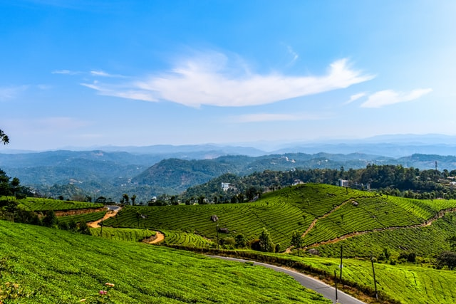

Some of the local attractions like Salim Ali Bird Sanctuary and elusive Nilgiri Tahr attract tourists from all across the world over here. Nestled between the beautiful hills of Munnar is a pristine waterfall named Atukkad Waterfall, where you can come for a romantic escapade. Photopoint is another stunning destination in Munnar filled with sparkling stream and calm woods and is an ideal spot for taking photographs. 
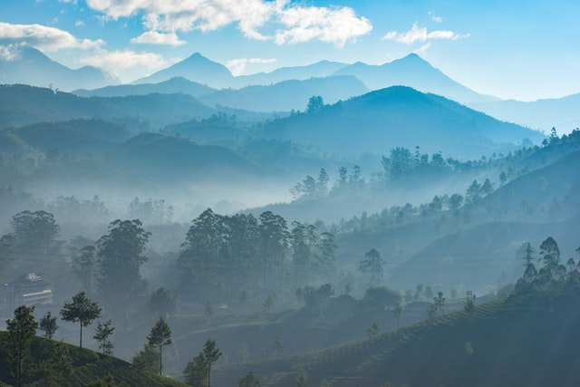
Trekking and camping are the most popular activities that you must try during your visit to Munnar. Apart from this, you can stay in a treehouse or visit the tea plantations for a surreal experience. Safari tour of Eravikulam National Park and Shikara ride in Kundala lake should also be the top things to do in Munnar.

The weather in Munnar remains quite pleasant throughout the year, but in summer, people especially come to this place to escape from the scorching heat in other parts of the country. During monsoon season Munnar experiences heavy rainfall that might hamper your travel plan as most of the activities are restricted during this time of the year. The best time to visit Munnar is between March to September when the weather stays very pleasant. 

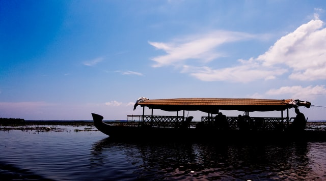

#### Getting there

- Nearest railway station: Aluva about 108 km and Angamali, about 109 km

- Nearest airport: Cochin International Airport, via Aluva - Munnar Rd, about 108 km

### Places to Visit

#### Eravikulam National Park
One of the main attractions near Munnar is the Eravikulam National Park. This park is famous for its endangered inhabitant - the Nilgiri Tahr. Spread over an area of 97 sq. km., this park is also home to several species of rare butterflies, animals and birds. A great place for trekking, the park offers a magnificent view of the tea plantations caressed by blankets of mists. The park becomes a hot destination when the hill slopes here get covered in a carpet of blue, resulting from the flowering of the Neelakurinji. It is a plant endemic to this part of the Western Ghats which blooms once in twelve years. 

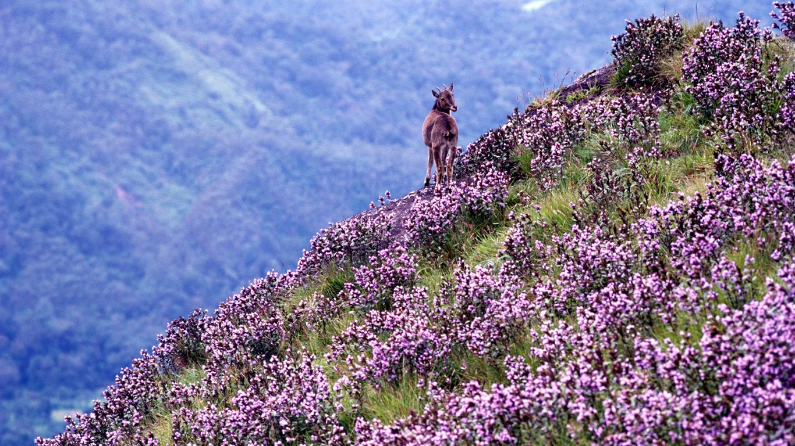

#### Anamudi Peak
Located inside the Eravikulam National Park is the Anamudi Peak. This is the highest peak in South India, standing at a height of over 2700 m. Treks to the peak are allowed with permission from the Forest and Wildlife authorities at Eravikulam.

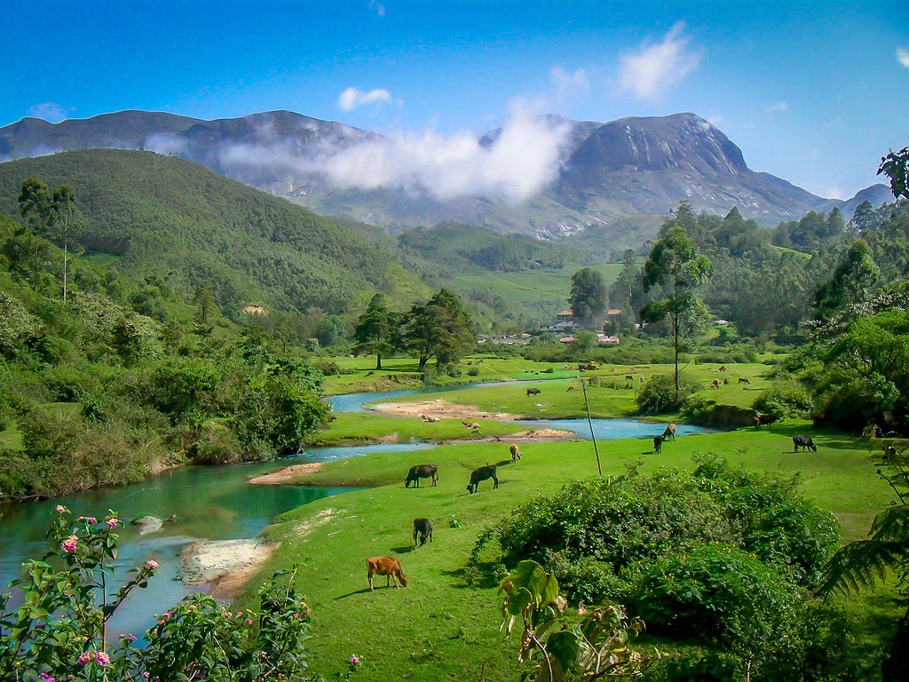

#### Mattupetty
Another prime draw for visitors, located about 13 km from Munnar Town, is Mattupetty. Situated at a height of 1700 m above sea level, Mattupetty is known for its storage masonry dam and the beautiful lake, which offers pleasurable boat rides, enabling one to enjoy the surrounding hills and landscape. Mattupetty's fame is also attributed to the dairy farm run by the Indo-Swiss Livestock Project, where one can encounter different high yielding breeds of cows.

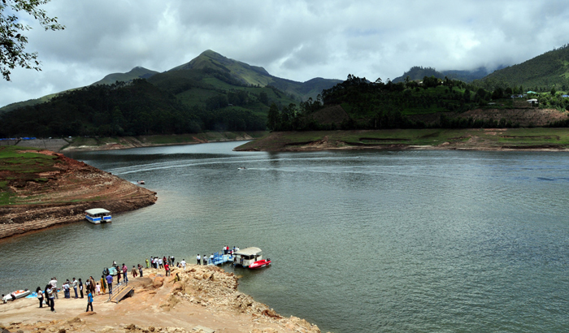

#### Pallivasal
Pallivasal, located at about 3 km from Chithirapuram in Munnar is the venue of the first hydro-electric project in Kerala. It is a place of immense scenic beauty and is often favoured by visitors as a picnic spot.

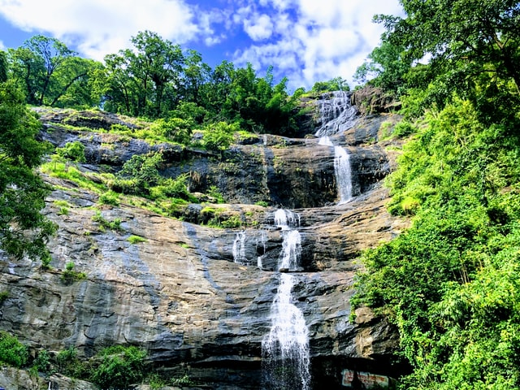

#### Chinnakanal & Anayirangal
Near Munnar Town lie Chinnakanal and its waterfalls, popularly known as the Power House Waterfalls, which cascade down a steep rock 2000 m above sea level. The spot is enriched with a scenic view of the Western Ghat ranges. When you have traveled about seven kilometers from Chinnakanal, you reach Anayirangal. Anayirangal, 22 km from Munnar, is a lush green carpet of tea plants. A trip on the splendid reservoir is an unforgettable experience. The Anayirangal dam is surrounded by tea plantations and evergreen forests.

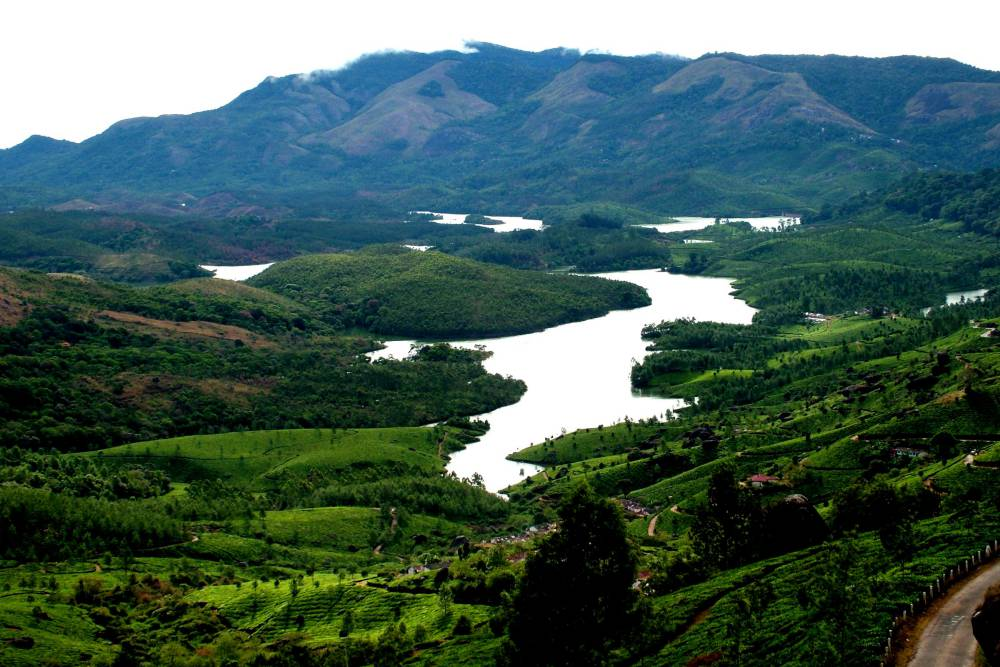

#### Top Station
Top Station, which is about 32 km from Munnar is at a height of 1700 m above sea level. It is the highest point on the Munnar-Kodaikanal road. Travellers to Munnar make it a point to visit Top Station to enjoy the panoramic view it offers of the neighbouring state of Tamil Nadu. It is among the prime spots in Munnar to enjoy the Neelakurinji flowers blooming over a vast area.

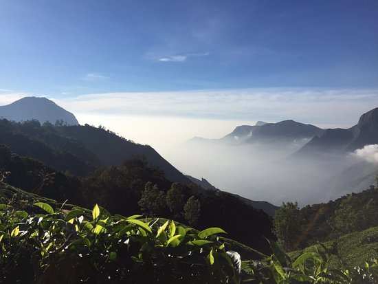

#### Tea Museum
Munnar has a legacy of its own when it comes to the origins and evolution of tea plantations. Taking account of this legacy and to preserve and showcase some of the exquisite and interesting aspects of the genesis and growth of tea plantations in Kerala's high ranges, a museum exclusively for tea was opened some years ago by Tata Tea in Munnar. This Tea Museum houses artifacts, photographs and machineries; all of which have a story to tell about the origins and growth of tea plantations in Munnar. The museum is located at the Nallathanni Estate of Tata Tea in Munnar and is worth a visit. Read more on Munnar

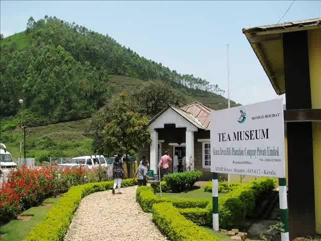

#### Trek to Meesapulimala 
Let us now explore some of the options in and around Munnar that would provide travellers with ample opportunities to enjoy the captivating hill station of Munnar.  Meesappulimala - a destination for the highly adventurous is the second highest peak in the Western Ghats and a trekking trail via Rhodo Valley. The package includes guide service, breakfast, lunch, evening tea & dinner.

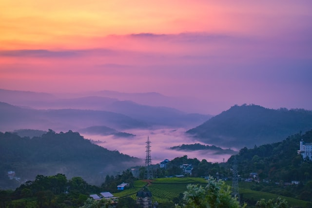