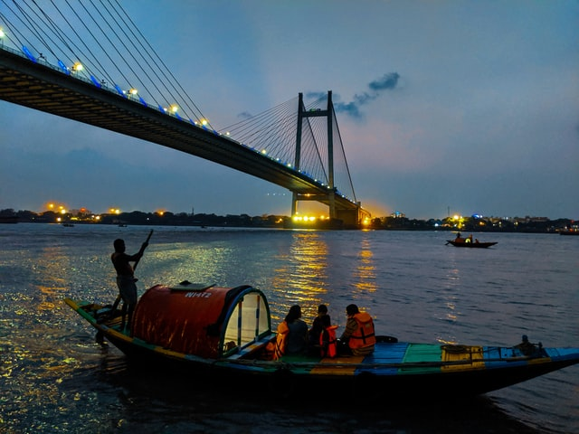
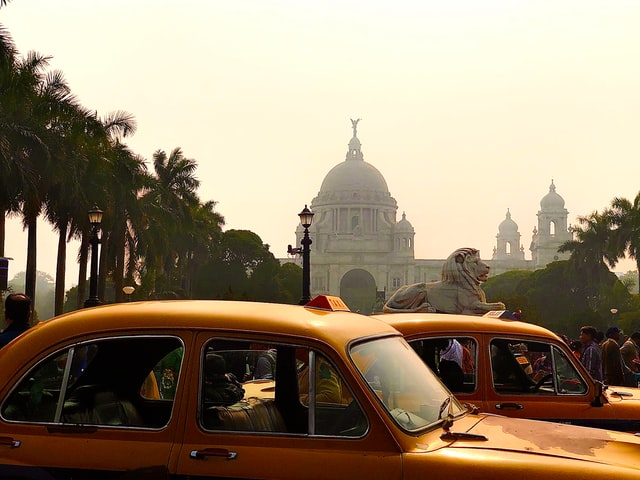
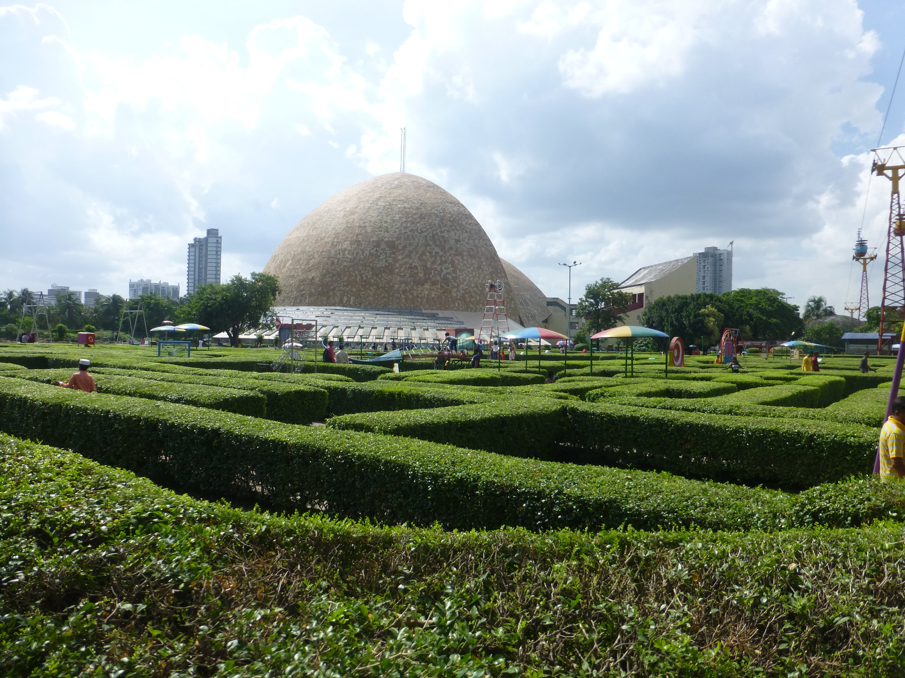
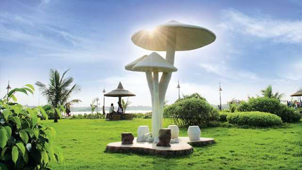
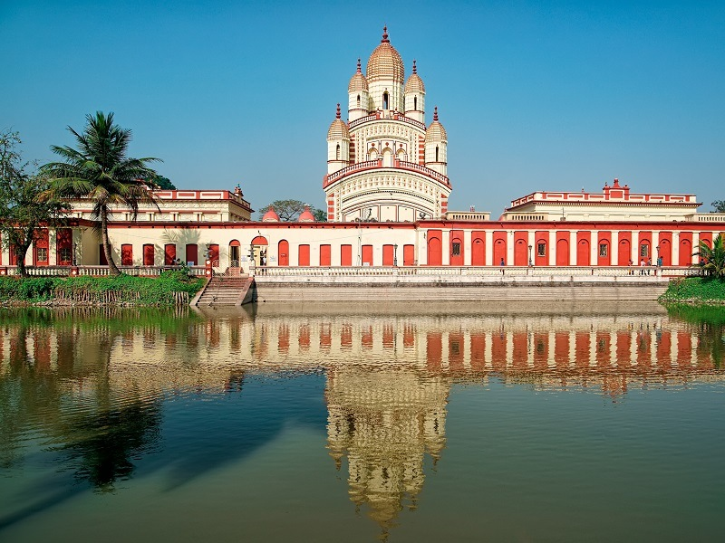
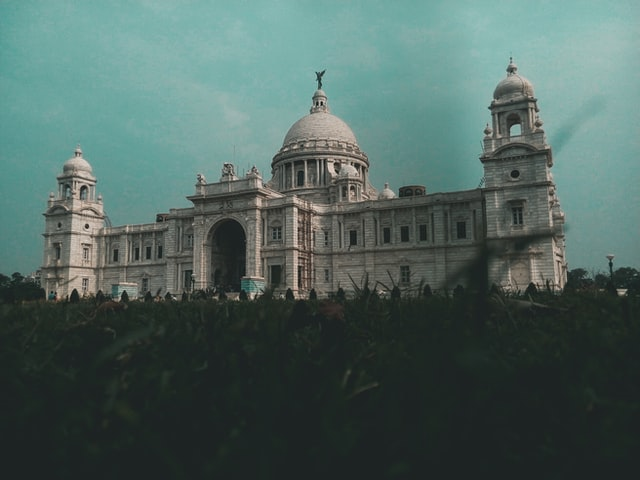
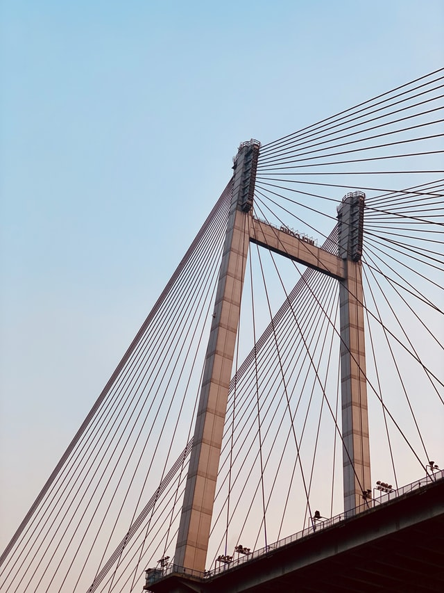
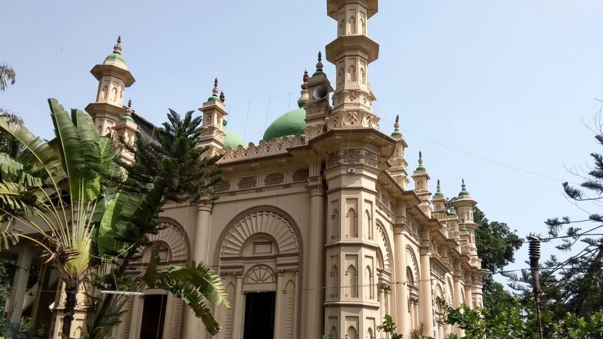
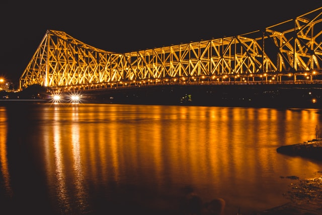

Kolkata, The City of Joy, the cultural hub of India, this particular city has been called by so many names by people who have come and fallen in love with the place. Kolkata is known for its history and for being the city of Rabindranath Tagore, Satyajit Ray, and many more legends who have put India on the world map. If you are visiting India and touring the country then this is one city that you must include in your plan. Kolkata is also comparatively more affordable than most big cities of the world. It has no shortage of joy, warmth, and peace to embrace you with; and there is no dearth of tourist places in Kolkata, thanks to its rich history and culture.

Kolkata is one of the most populated cities of India, but that’s a good thing for you as a traveler. Diversity is Kolkata’s finest characteristics; hence, you will get to meet people from different culture and with different stories. Food, music, culture, literature, everything about this city is so rich and intellectually fulfilling. The city so perfectly combines the comfort of a metropolitan and the nostalgia of a place that has been through multiple cultural and social revolutions. It has the country’s oldest museum where you can see, among other things, the only mummy in India. Kolkata used to be one of the most important cities politically during the British rule, which has resulted in architectural influences. You can experience them with The Victoria Memorial, Fort William, Writer's, and many more such historical buildings.

If you are a religious person then Kolkata has a lot to offer you too. Some of the world’s oldest and most popular temples, churches, and masjids are located in and around this city which are some of the most important tourist places in Kolkata. You can go on a day tour of all the religious places while enjoying the street food during your breaks. Include a visit to the Ganges River in the plan to complete the tour.

### Tourist places in  Kolkata

#### Victoria Memorial
 
The Victoria Memorial is a large marble building in Kolkata, West Bengal, India, which was built between 1906 and 1921. It is dedicated to the memory of Empress Victoria, and is now a museum under the auspices of the Ministry of Culture. The memorial lies on the Maidan.

#### Science City

The Science City of Kolkata is the largest science centre in the Indian subcontinent. It is Managed by National Council of Science Museums, Ministry of Culture, Government of India.

#### Eco Park

New Town Eco Park is an urban park in New Town, Rajarhat, Kolkata and the biggest park so far in India. The park is situated on a 480 acres plot and is surrounded by a 104 acres waterbody with an island in the middle.

#### Dakshineswar Kali Temple

Dakshineswar Kali Temple is a Hindu navaratna temple located at Dakshineswar. Situated on the eastern bank of the Hooghly River, the presiding deity of the temple is Bhavatarini, a form of Kali, otherwise known as AdishaktiKalika. The temple was built in 1855 by Rani Rashmoni, a philanthropist and a devotee of Kali. The temple is known for its association with Ramakrishna and Ma Sarada Devi, mystics of 19th Century Bengal.

#### Fort William

Fort William is a fort in Calcutta, built during the early years of the Bengal Presidency of British India. It sits on the eastern banks of the River Hooghly, the major distributary of the River Ganges. One of Kolkata's most enduring Raj-era edifices, it extends over an area of 70.9 hectares. The fort was named after King William III. 

#### James Prinsep 

Prinsep Ghat is a ghat built in 1841 during the British Raj, along the Kolkata bank of the Hooghly River in India. The Palladian porch in the memory of the eminent Anglo-Indian scholar and antiquary James Prinsep was designed by W. Fitzgerald and constructed in 1843. Located between the Water Gate and the St George's Gate of the Fort William, the monument to Prinsep is rich in Greek and Gothic inlays.

#### Tipu Sultan Masjid
 
The Tipu Sultan Shahi Mosque is a famous mosque in Kolkata, India named after Tipu Sultan the ruler of Mysore. Located at 185 Dharamtalla Street, the mosque is a relic of architectural and cultural heritage.

#### Howrah Bridge

Howrah Bridge is an architectural marvel and a well-known Kolkata landmark. It has served as a backdrop for numerous movies since the 1950s, including a 1958 film named after the bridge. Walk across the bridge and admire its unique construction or glide underneath while on a boat ride along the Hooghly River.

Reach the bridge from any part of Kolkata by bus, taxi or rental car. The nearest railway station is also called Howrah Bridge and is a 5-minute walk away. Make a point of coming back to the river at night to see the bridge bathed in different colored lights.

