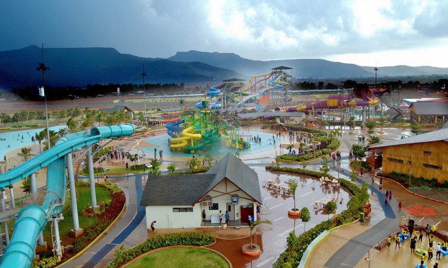

### Overview

Lonavala city is one of the most beautiful retreats, that takes you away from the maddening rush of the metropolises. It is located in the western part of India in the Pune district of Maharashtra. This hill station lies 96 kilometers east to the metropolitan city of Mumbai and 64 kilometers west to the modern-day Pune city. Therefore, a profound location on the Mumbai-Pune expressway makes Lonavala cater to both the cities with the smoothest connectivity through roads.

The Lonavala City is popularly called the “city of caves' ' and the “Jewel of Sahyadri”. That is because the hill station boasts of some of the most spectacular settings that include luxuriant green valleys, remarkable caves, serene lakes and stunning waterfalls. The spectacular rock-cut Bhaja and Karla caves in Lonavala have been amazing tourists with their old beams, motifs and inscriptions.

The surrounding regions of Lonavala are blessed with an unbeatable collection of waterfalls that include the Kune waterfall, Bhivpuri, Bhagirath and Jummapatti waterfalls. The refreshing ambiance of the postcard-perfect landscape of Aamby Valley, Pawna Lake and Lonavala Lake are bound to impress you. Lonavala is also famous for its natural wonders, religious attractions, and historical sites. These include the Tikona Fort, Duke’s Nose, Lohagad and Rajmachi forts.

Lonavala hosts an array of fun activities for the tourists and these include rappelling, camping at the Pawna Lake, hiking to the Tikona Fort, trekking to the Rajmachi fort and riding the Imagica slides.

Lonavala has a tropical climate but the weather is an all-time maritime one. However, all the stunning places and sites of Lonavala come alive during the winter and monsoon seasons. Thus, pack your bags and come here because Lonavala has something for everyone, from quiet time to adventure.

------
### Top Places To Visit In Lonavala

###### **1 Visapur Fort**

Visapur Fort is perched atop a lush green hill of Ratnagiri district in Maharashtra. It accounts for a popular tourist excursion point amongst adventure mongers and nature lovers. With an elevation of 1084 meters from the sea level, it offers some phenomenal views of the surrounding lush green hills. 

Marking its prominence from the 18th century, this fort forms a part of the fortification of Visapur and Lohagad. This gigantic architectural marvel features ancient caves, arches, wells, and old houses. A bit further, notice the beauty of two roofless buildings. As Hanuman was considered to be the patron deity of Visapur, you can find many temples dedicated to him. 

Within the Visapur Fort, there’s a famous well, which is believed to be built by the Pandavas. Somewhere nearby, you could find the presence of guns and other ammunitions belonging to the reign of Queen Elizabeth. Within its vicinity, there are also remnants of Mahadev’s shrine. 

Other attractions of the Visapur Fort includes few isolated caves, old house ruins, ancient water cisterns, and a huge flour mill. 

Trekking to the top summit of Visapur Fort is an unforgettable adventure for every single visitor. Although the climb is a rocky one, the trek is serene and tranquil. You could either start your trekking adventure from Lohagadwadi or Patan Village. You may also try a hand at paragliding activity which takes place nearby. 

###### **2  Rajmachi Fort**

Are you looking for a place where you can spend a weekend in the lap of nature's unbound beauty and participate in some engaging fun activities? If so, Rajmachi Fort has to be in your bucket list for next holiday trip. 

The historical fort dating back to the time of the great Maratha ruler Chatrapati Shivaji is located amidst the lush green Sahyadri range and is one of the most sought after trekking destinations in Maharashtra where you can experience nature at her varying moods. 

The trekking trail to Rajmachi Fort abounds several waterfalls, deep gorges and valleys, quaint villages, waterways and many more to feast your eyes on. To get a first hand experience of this amazing trek you should have a fair knowhow of the place and the pros and cons of Rajmachi Fort trek.

###### ** 3 Magic Mountain **

Magic Mountain has an amusement park has thrill rides divided as per their difficulty level and into various categories. There are high thrill rides, mid thrill rides, and family rides. Some of these include Top Spin, Giant, Delta Hoppla, Space Trainer, Turbo Force, and Z force. Out of all, Top Spin remains to be a favourite of most.

The park also has restaurants that serve a variety of delicacies and make sure to take care of all hungry souls. The park has additional paid services like medical bay, parking, shuttle services, street magician, toy shops and much more.

Location:
- Old Pune Mumbai Highway NH - 4, at Mundhaware, Post - Takve, Pune

Timings:
- 10:30 AM to 6 PM on all days

Entry fee:
- Tickets start at INR 799 per head, rates differ for corporate and college student bookings

###### ** 4. Tikona Fort **

Tikona Fort is a dominant hill fortress of Konkan’s Pawan Maval region. This is Maharashtra’s popular one-day trekking spot. Locally, it is famous by the name Vitandgad. Situated on top of the Tikona peak, this fort has an altitude of 3633 feet from the sea level.

If you take a look at its present-day geography, it resembles a triangle and thus named as Tikona. Large fortifications, seven water tanks filled with crystal clear water, large doorways, and spectacular surrounding views from its bastion sums up the beauty of this place. Sahyadri’s green hillocks are just like cherries on the cake!

Many Maratha dynasties have marked their presence here in the past and also, Tikona Fort was known as the centre for Pauna Mawal’s primary activities. Tikona Fort’s entrance itself represents beauty with sophistication. As soon as you pass through it, you will witness the presence of Buddhist and Satavahana Caves within. 

Both types of caves have great significance in Indian history. Besides, there’s a small Trimbakeshwar Mahadev temple inside which revives the spiritual beliefs of the first residents of this fort.

With no wonders, Tikona Fort is blessed with some stunning landscapes attracting heaps of trekking enthusiasts and those who love Mother Nature. The moment you trek to the topmost summit of this fort, you have the liberty to enjoy the panoramic view of the vastly stretched Maval region. Tung Fort, Bhatrashi Hill, Jambhul Hill, Lohagad, Fagne dam, and Visapur are some sightseeing delights from the topmost position of this Tikona Fort.

###### ** 5. MTDC's Water Park **

MTDC’s Water park is also a resort that offers great views of the Sahyadri range. It is located right next to the water sports center. The water park is also called Karla water park and has a number of slides for children as well as adults to enjoy. It has a dedicated area for rain dance along with a wave pool. 

The water park offers water sport activities such as jet-skiing, paddle boat, motorbike, water scooter which is absolutely safe for enthusiasts of all age groups to indulge in. Visitors to this water park can choose to spend the night at MTDC’s resort for a relaxed experience and may also visit the nature park which is located on the same premises.

Location:
- Lonavala Road, Karla

Timings:
- 11 AM to 5:30 PM on all days

Entry fee:
- For children under 4 feet - INR 200 per head, 
- for guests residing at the MTDC Karla resort and entering water park -INR 300 per head
 - For outsiders - INR 350 per head. 

###### ** 6 Korigad Fort **

Snuggled 20 km away from Lonavala in Pune, Korigad Fort is one of the scenic spots showcasing the grandeur of Shivaji’s Legacy. This elegant edifice was built back in the 15th century and is established at a soaring height of 929 meters above the ground. The serenity of the site is maintained with the three elegant temples that are built on the notch of the peak. 

From the base point, which is the Peth Shahpur village there’s a staircase of 600 stairs that you need to traverse to reach the fort. At this fort, you can take a deep insight into the lifestyle of Maharaj Shivaji and gape at the intriguing architectural style of the building. The entire display reminds of the Maratha warriors and is surrounded by the colossal ranges. 

###### **7 Tung Fort**

Enclosed in vast tropics and found at an astounding height of 1075m from sea leave, Tung fort is a mesmerizing destination in Maharashtra, India. The fort is specifically admired for its breathtaking views and spectacular treks. The literal translation of the word “Tung” is “difficult” and hiking to this momentous fort is surely a task. Apart from this, the place is also excellent for a family picnic and camping. 

Furthermore, the peaky and oval structure of the fort makes it a prominent attraction from a distance. From the top of the fort, visitors can enjoy an alluring view of the dazzling Pawna Lake, Tikona and Visapur fort. After a climb, the visitors can also unwind and visit either the Tungi Devi or Ganpati temples. The best time to enjoy a visit to this glorious place is just after the rainy season, between September and January.

###### ** 8 Bhaja Caves **
 If you are looking for any historical yet exciting location to visit in India - Bhaja Caves is for you. Bhaja Caves are located at Lonavala, Maharashtra, that are dating back to 160 BC. These 22 groups of rock-cut caves are considered to be subsisting from the second to the first century BC. 

The Caves were developed during Satavahana's rule and are the biggest Hinayana Buddhist temple in India. Adorned with the classic Indian rock-cut architecture of the era, the architecture of these caves narrates the actual culture and tradition of India and the ancient Indian period. The topmost captivations of these caves are the Stupas, which have the caves carved profoundly outside and inside both.

Furthermore, lush greenery all around the caves creates a spectacular aura that pleases many eyes. Also, there is a magnificent waterfall close to the cave that offers you a chance to take a delightful dip into it. The visitors will discover an unusual cluster of 14 stupas, nine in exterior, and five in the interior of a smaller cave. Thus, Bhaja caves are the go-to destinations for all those who are history enthusiasts.
 It will prove to be an amazing sightseeing trip to the past glory of mythological India.

 