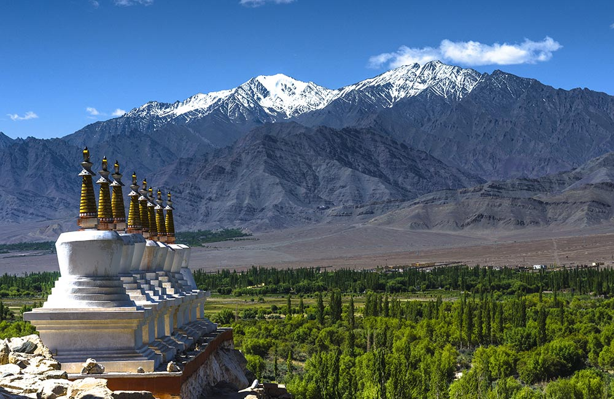

### Overview
 
 
 Whether you are on a solo sojourn in search of inner peace, an adventure backpack tour with your besties or a honeymoon trip with your beloved, Manali and its mountains will never cease to fascinate you. The hill town has blossomed into a paradise for the wandering heart and it also has some cultural gems that are unique to this part of the world. And the budget-friendly hotels in Manali will take care of your accommodation while giving you a taste of the hospitality the region is known for.

------
### Top Places To Visit In Manali
###### **1. Hidimba Devi Temple**

Also known by the names Hidimba Devi Temple and Dhungari Temple, this ancient shrine was built by Maharaja Bahadur Singh way back in 1553. As the name suggests, the temple is dedicated to Hidimba Devi, wife of Bheema. The wooden architecture of the shrine is very distinct from most Hindu temples you will come across in the country. There’s another shrine dedicated to Hidimba Devi’ son Ghatotkacha in the premises. Surrounded by thick cedar groves and with snow-capped mountains serving as the backdrop, the temple is one of the best places to visit in Manali.

Location: 
- Old Manali
Timings:
- 8:00 am to 6:00 pm; every day

###### **2. Solang Valley**
A mini valley located at about 8400 feet above sea level, Solang Nala is a short drive away from Manali. It is a haven for adventure and sports lovers and while here, you can try your skills on a pair of skis or go for a snowmobile exploration. When the weather warms up, people flock here for zorbing and paragliding. You can also hop onto a cable car and enjoy mesmerizing views of the Himalayas. If you are looking for snow-based activities and sports, winters are the best time to visit while the months of summer are ideal for other adventure sports.

Location:
- Burwa, Manali
Distance from Manali:
- 14 km (approx.)

###### **3. Jogini fall **
The rushing cascades of Jogini Falls are a short and invigorating trek away from the main town of Manali. The trail that leads to the waterfall is scenic and gives you a glimpse of the River Beas and the snow-capped peaks of Rohtang. Apart from the serene setting, Jogini is also an important place of pilgrimage and you can visit many old shrines around the pool at the bottom. An early start is recommended so that you can spend more time at this picturesque natural spot, which is one of the top trekking as well as picnic places in Manali.

Location: 
- Vashisht Village, Manali
Timings:
- 24×7

###### **4. Manali Gompa**

The ornate design and the quintessential Tibetan architecture make the Gadhan Thekchhokling Gompa, more commonly referred to as the Manali Gompa, one of the finest landmarks in Manali. Built by Tibetan refugees in the 1960s, this monastery allows you to enjoy quiet settings and unmatched spiritual vibes.  Some of the key highlights of the Manali Gompa include exquisite murals that depict important events of Buddhism in vivid colors and roofs built in the Pagoda style. The stalls in the complex are a good place to pick up some souvenirs and Tibetan handicraft items.

Location:
- Old Manali Road, Manali
Timings:
- 6:00 am to 6:00 pm; closed on Sundays

###### **5. Bhrigu Lake**
Take a moment and think of postcard-perfect alpine meadows and evergreen tree forests near a serene high-altitude water body. Well, you have just now pictured Bhrigu Lake, one of the best trekking destinations around Manali. A bit of acclimatization is needed if you are going for the trek as the lake is located more than 4000 meters above sea level. The scenery and panoramic views of the Pir Panjal Range are what draws most visitors to this place.

Location:
- Kullu District, Manali
Distance from Manali: 
- 19 km (approx.)

###### **6. Nyingmapa Buddhist Temple**
The soothing silence of the Nyingmapa Buddhist Temple in Manali will calm even the most frazzled of nerves. This Shangri-La-like haven sits in the middle of the busy town, while its pagoda-style architecture and vibrant tones add a mystical allure to the whole setting. While here, don’t forget to spin the prayer wheels and admire the Sakyamuni idol and wall paintings. Counted among the best monasteries in Manali, Nyingmapa is where you can connect with your spiritual side. 

Location:
- Near Manali Mall Road, Manali
Timings: 
- 6:00 am to 7:00 pm; every day
Entry Fee:
- No entry fee; photography is charged at Rs 20

###### **7. Museum of Himachal Culture and Folk Art**
A quick stop at the Museum of Himachal Culture and Folk Art is recommended for those who want a glimpse into the traditions and rich local heritage of the region. Some of the exhibits here include a collection of masks used in festival dances, traditional garments, and musical instruments. Established in 1998, this small yet culturally rich place also has models of ancient houses and temples.

Location:
-  Utopia Complex, Hadimba Temple Road, Manali
Timings:
- 9:00 am to 7:00 pm (April to November); 10:00 am to 6:00 pm (December to March)
Entry Fee:
- ₹ 10 per person

------
### Adventures In Manali

###### 1. Rafting

River rafting is one of the most awe-inspiring adventure sports in Manali that can be done throughout the year. However, the best time for river rafting in all its glory is April to June and October to March. The rivers are fresh and rapid, flowing with unobstructed connectivity. 

There are two types of packages for rafting – Short River Rafting that goes up to 7km and Long River Rafting for 14 km. There are various classifications of the rapid flow of current – Grade I, Grade II, Grade III and Grade IV.

Places, where you can experience river rafting and white water rafting are: 

- River Beas
- Tattapani

###### 2. trekking

One of the robust adventures in Manali is trekking. On to the snowy mountains of the Himalayas or interspersed rocky terrains, treks are a thrilling getaway for those seeking solidarity and seclusion. Not only this, but many groups of friends or those looking for cultural exposure often resort to this adventurous activity in Manali. 

The dense forests, streams of rivers, and sacred temples make for a picturesque getaway. Several cave temples also fall on the way or are the destination for devotees seeking spirituality.

Places where you can have a venturesome trekking experience are:

- Kheerganga Trek, Kasol
- Tosh Valley Trek
- Chandrashila Trek

###### 03. Paragliding 

If you ever wanted to fly sky high, then paragliding is what you are looking for. It is a popular adventure sports in Manali due to its location. It is planted on hills as high as 2000 meters above the sea level. The wind conditions are idea most of the time, and approachability to the sport is easier as there are various operators serving the cause. 

However, the best time to paraglide in Manali is from April – June when the temperature varies from 10 – 25 degrees Celsius.

Places, where you can have the best paragliding experience, include:

- Solang Valley
- Parvati Valley

###### 04. skiing
 Skiing has gained popularity as an adventure sport in Manali due to the snowy Himalayan Mountains. Even though the cold continues after January, the best time to experience skiing in Manali is in December and January. Post this time; skiing persists depending upon the snowfall. It comes to a halt after April. 

However, you must keep in mind to carry a lot of warm coats and medicines for cold and flu. You might also want to get a health check-up for altitude sickness before taking upon this sport.

Places where you can have the most illuminating skiing adventure include:

- Rohtang Pass

- Solang Valley
