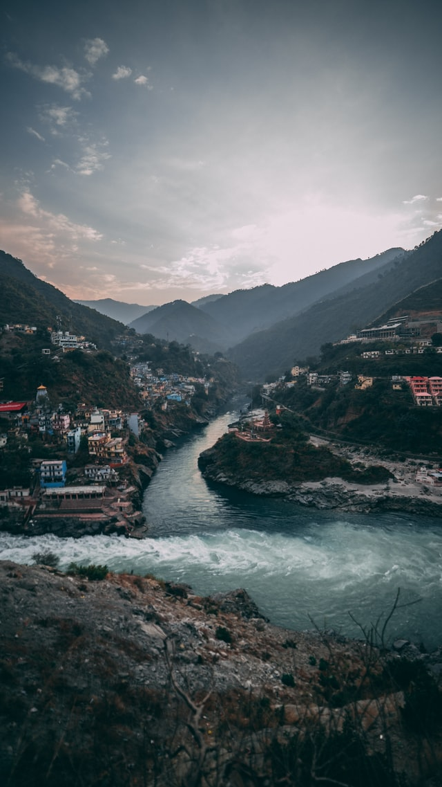
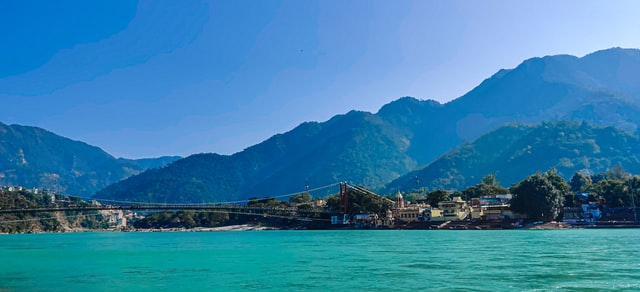
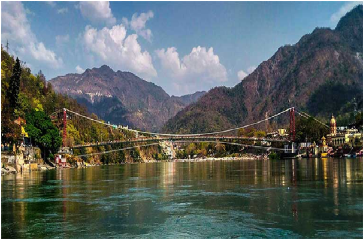
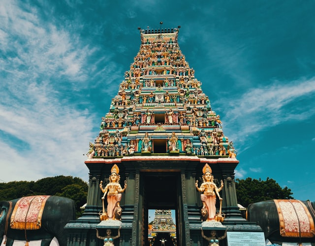
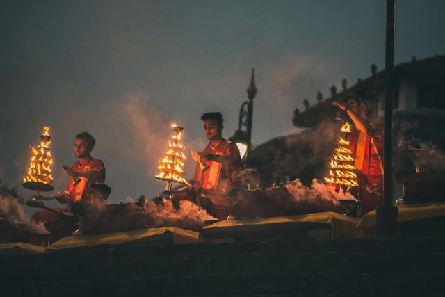
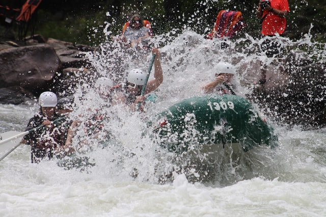
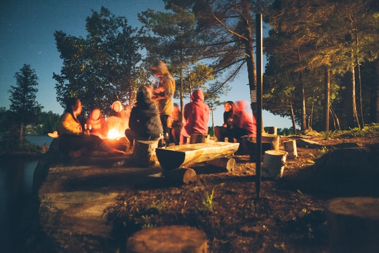
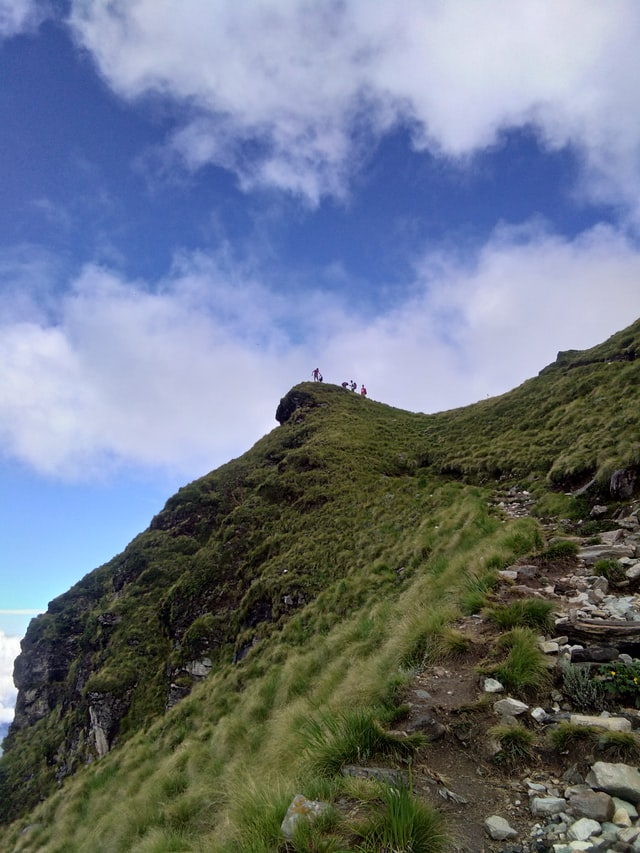

### Overview
Rishikesh is also known as Hrishikesh. It is located in the foothills of the Himalayas in northern India, it is known as the "Gateway to the Garhwal Himalayas" and "Yoga Capital of the World". It lies 21 km  north of the city Haridwar and 45 km southeast of the state capital Dehradun.  It is known as the pilgrimage town and regarded as one of the holiest places for Hindus. Hindu sages and saints have visited Rishikesh since ancient times to meditate in search of higher knowledge.  Due to the religious significance of the place, non-vegetarian food and alcohol are strictly prohibited in Rishikesh. The scenic beauty of Rishikesh is due to its location at the foothills of the lofty Garhwal Himalayas is accentuated by the mighty Ganges cutting right through the city. The picturesque city looks suspended between the stunning riverside promenades, acres of forests, lush mountains, and clear blue skies lending it a surreal appearance. The city is synonymous with its grand temples, rituals, architectural marvels and yoga ashrams. jaw-dropping spectacle of the Maha Aarti.

### Fast Facts

- Nearest Airport Jolly Grant Airport.
- Best time to visit Rishikesh is February to mid-May.
- Languages Hindi,Garhwali.

------
### Top Places To Visit In Rishikesh

###### 1. LAXMAN JHULA

The Lakshman Jhula is a famous hanging bridge across the river Ganga that connects two villages, Tapovan in the Tehri Garhwal district and Jonk in the Pauri Garhwal district. Located 5 kms to the northeast of the town Rishikesh in the Indian state of Uttarakhand, the entire bridge is made up of iron. The Lakshman Jhula is well-known amongst tourists because it is believed that Lord Lakshman, the younger brother of Lord Rama, had crossed the river Ganga at this same site, where the bridge now majestically stands for all to see.

###### 2.RAM JHULA

Ram Jhula is an iron suspension bridge across the river Ganges, located 3 kilometres (1.9 mi) north-east from the town Rishikesh in the Indian state of Uttarakhand. The bridge connects the Sivananda Nagar area of Muni Ki Reti in Tehri Garhwal district to Swargashram in Pauri Garhwal district crossing the river from west to east. Built in the year 1986, the bridge is one of the iconic landmarks of Rishikesh. It is also a connecting bridge between Sivananda Ashram located in Muni Ki Reti to Gita Bhawan, Parmarth Niketan and other temples located in Swargashram.

###### 3.NEELKANTH MAHADEV TEMPLE

Neelkanth Mahadev Temple is a Hindu temple dedicated to Nilkanth, an aspect of Lord Shiva. The temple is situated at a height of 1330 meters and is located about 32 km from Rishikesh.The temple isone of the most revered holy shrines dedicated to Lord Shiva and is a prominent Hindu pilgrimage sites. It is surrounded by dense forests and is adjacent to the mountain ranges of Nar-Narayan.

###### 4.TRIVENI GHAT

Triveni Ghat is the biggest and most famous ghat in Rishikesh at the banks of Ganges. The name Triveni means three and that comes from the fact that it is the confluence of three major rivers of India namely Ganga, Yamuna, and Saraswati.It is believed that the ghat was visited by Lord Krishnawhen he got hurt by the arrow of Jara – a hunter. The ghat is famed for the Ganga aarti performed to the chants of Vedic hymns.

------
### Adventures In Rishikesh

###### 1. Rafting

Rafting  if one of the most exciting and thrilling experience.Kaudiyal is the greatest point in Rishikesh rafting. It is mainly intended for advanced or professional rafters. This 8-9 hour long rough route passes through the banks of Shivpuri, Bramhapuri, Marine Drive and Byasi.

###### 2. CAMPING

Camping in Rishikesh is one of the second best things to do after the white water rafting. The pleasant environment, the picturesque views make it a great camping ground. The Rishikesh rafting season brings in not just rafters but also campers who love to watch the stars waltzing in the dark.

###### 3.	 WATERFALL TREKKING

 Rishikesh adventure sports is one of its kind and waterfall trekking in Rishikesh is one of the many thrilling adventures sports you witness. In this sport, one can trek up the waterfall and feel the gushing water.

