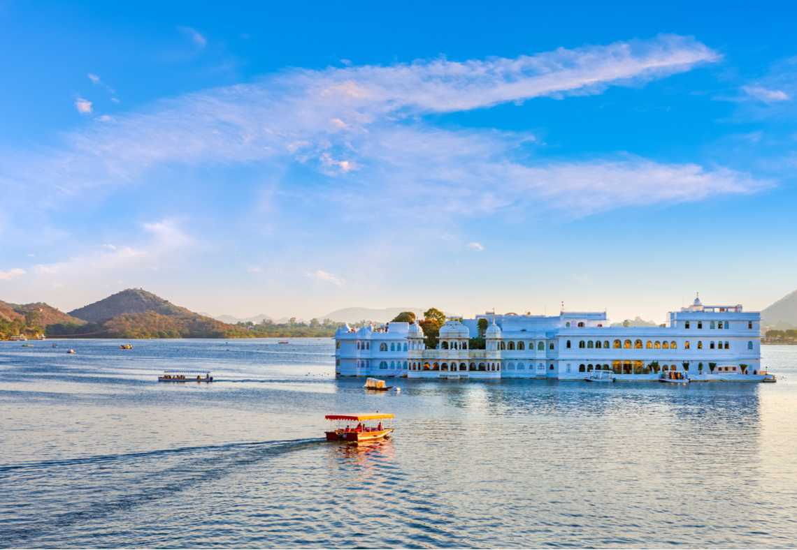

### Overview

With many places to visit in Udaipur, this city is a famous tourist destination in India and is often referred to as the 'Venice of the East', the city of lakes. Udaipur is located around azure water lakes and is hemmed in by lush green hills of Aravallis. The famous Lake Palace, located in the middle of Lake Pichola is one of the most beautiful sights of Udaipur. 

It is also home to Jaisamand Lake, claimed to be the second largest man-made sweet water lake in Asia. This crown jewel of the state of Rajasthan. It is surrounded by an abundance of natural beauty, mesmerizing temples and breathtaking architecture which makes it a must-visit destination in India.  A boat ride through the serene waters of Lake Pichola will be enough to prove to you why Udaipur is the pride of Rajasthan. 

Located in a valley and surrounded by four lakes, Udaipur has natural offerings with a grandeur multiplied by human effort, to make it one of the most enchanting and memorable tourist destinations. It justifies all names ever offered to its charm from 'Jewel of Mewar' to 'Venice of the East'. 

And though the entire city's architecture is flattering, the Lake Palace hotel is something that offers the city a visual definition. The revered Nathdwara temple is about 60 km from Udaipur. Udaipur is the perfect tourist destination for people looking forward to experience loads of culture and heritage. 

------
### Top Places To Visit in Udaipur

###### **1 The Lake Palace**

The Lake Palace in Udaipur is located on the Jag Niwas Island on a sprawling 1.5-hectare land. This magnificent structure was built on the Lake Pichola by Maharana Jagat Singh in 1734. Once a summer palace for the royalty of Udaipur, it has now been converted into a heritage hotel.

Still retaining the grandeur, it resembles a fairy tale kingdom. Enhancing the magical aura are the rippling waves and the beautiful sunset. The intricate craftsmanship and aesthetic handicrafts and textiles add to the beauty this place. The elegant white marble palace is a fantasy as it arises softly from the blue waters. 4 acres of rock have been used to lay the foundation of this palace and was known as Jag Niwas after its founder. 

The palace highlights include fountains, gardens, pillared terraces, painted mirrors, pink stone work, lotus leaves and cusped arches. Dhola Mahal, Bada Mahal, Phool Mahal, Ajjan Niwas and Kush Mahal are some of the apartments in here.

There are various facilities available in the palace for the guests like the swimming pool, bar, restaurants, café and conference hall. There is also a 24-hour business center and 8 meeting rooms with fully updated equipment for corporate meetings and conferences. In here are 12 banquet halls for cocktail parties, wedding and other related functions. 

Distance from the City:
- 2 kms

Location:
- Pichola, Udaipur, Rajasthan 313001ekking to the top summit of Visapur Fort is an unforgettable adventure for every single visitor. Although the climb is a rocky one, the trek is serene and tranquil. You could either start your trekking adventure from Lohagadwadi or Patan Village. You may also try a hand at paragliding activity which takes place nearby. 

###### **2 Fateh Sagar**

The Fateh Sagar Lake is known to be the second largest lake in this city, is located on the northern side of Lake Pichola and is just opposite the entrance to Moti Magri Mahal. This artificial lake was built by Maharana Jai Singh in 1678 and got its name from Maharana Fateh Singh. This water body has a depth of 11.5 metres and extends 2.4 km in length and 1.6 km in breadth.

There are three intake channels and one overflow channel in the lake that actually comes in play during the monsoon season. The three small islands on the lake can be easily reached by a boat. The large island on the lake has a garden and a boat shaped restaurant named Nehru Park. This island also has a small zoo and is a favourite picnic place for the local people.

The second island on the lake has been converted into a beautiful garden with a lot of water jet fountains and is looked after by the government of the state. The third island is managed by the Udaipur Solar Observatory which is known as the best solar observing site in Asia.
This is a quiet place and one can enjoy a boat ride here. The beautiful lake is encircled by hills on all the three sides and offers a stunning view which is considered to be places to visit in Udaipur.

Distance from the City:
- 6 km

###### ** 3 The City Palace **
The City Palace in Udaipur in the state of Rajasthan has a lot in its store to reveal the age-old history it possesses. The royal building is a huge complex with plenty of rooms and pillars inside.

It took more than 300 years to complete the structure properly. Started during the time of Maharana Udai Singh II. The lake Pichola nearby is the highlight when you get ready for a tour of the greatest places to visit in Udaipur.

Since it is the biggest building in Udaipur it is considered as one of the best sightseeing destinations.  The flamboyant structure with a blend of Mughal and Rajasthani architectural style dominates other famous palaces and buildings around the city very authentically.

It is located on a hilltop where you can enjoy a real panoramic view of lake Pichola and the Lake Palace on the banks of this particular lake.

Distance from the City:
- 3kms

Location:
- Udaipur, Rajasthan, India

###### ** 4. Lake Pichola **
This is one of the most important places to visit in Udaipur. Lake Pichola is the reason we call Udaipur the ‘City of Lakes’. Built in 1362, and extending 3 miles in length and 2 miles in breadth, this lake is an essential part of Udaipur and far by its best feature. Astonished and amazed by the beauty of Lake Pichola, Rudyard Kipling once wrote: "If the Venetian owned the Pichola Lake, he might say with justice, `see it and die'".

Take Kipling at his word and visit Lake Pichola when in Udaipur, both in the day and at night. the lake takes on a whole new character depending on the time of the day. In the morning, lake and palaces are quiet. The lake is speckled with tourist boats and people clicking selfies line the shores. As night creeps in, all the Palaces around the lake light up and illuminate the lake. No boats, no birds, nothing to see except the lit-up palaces as they stand impressively around the lake. It is an awe-imposing spectacle.

The iconic sites around the lake include Udaipur City Palace, Mohan Mandir, Eklinggarh Fort, Jag Mandir, Pichola Palace etc. The Sitamata Game Sanctuary is located on its western shore.

Distance from the City:
- 5 kms

Location:
- Udaipur, Rajasthan

###### ** 5. The Vintage Car **
The vintage car museum in Udaipur was unveiled for the general public on 15th February 2000 and is one of the places to visit in Udaipur. This inauguration has allowed the local and foreign visitors to appreciate the collection of cars of the Maharanas of Mewar. The vehicles in the museum are more than 70 years old but each have been beautifully restored and live in to tell the story.

The vintage car collection is placed in the Mewar State Motor Garage. This place is also home to a famous garden restaurant, The Bougainvillea. This motor garage is semi-circular in shape and with its forecourt is housed inside a bigger courtyard.

There is an old Shell petrol pump inside the garage which is still in working condition. This garage was built during a time when only the Maharanas of Mewar had owned the cars.

Location:
- Near By The Garden Hotel, Gulab Bagh Rd, Shakti Nagar, Udaipur, Rajasthan 313001

Distance from the City:
- 3.2 kms

Timings:
- 9 am to 8 pm

###### ** 6 The Crystal Gallery **

The Crystal Gallery is housed inside the Fateh Prakash Palace and is a world famous gallery. It is spread across the upper gallery of the main Durbar Hall Sabhaghar and has been hailed as the single largest private collection of crystal across the world.

This is a very exclusive and exquisite crystal collection and was built by Maharana Sajjan Singh in 1877. It was ordered from a company based in Birmingham. This collection includes perfume bottles, dinner ware, glasses, objects d’art, furniture, decanters and much more. It also has a crystal bed which is only a single piece in this world. This crystal collection has been customised for the royalty of Mewar and all the objects have the crest of Mewar etched on it carefully.  

There is an audio guide service available at the gallery for the tourists. It narrates the history and small anecdotes about the Shriji Arvind Singhji, the crystal ware and the royal Mewar family. There is a restaurant at the gallery for refreshments and photography is strictly prohibited.

Timings:
- 9am to 7 pm

Photography:
- Not allowed

